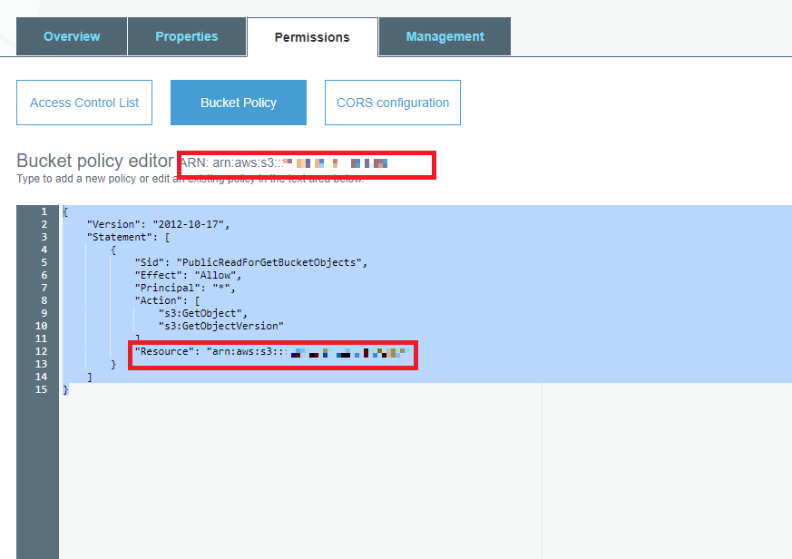
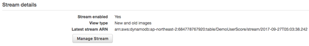
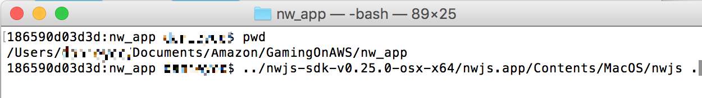

<center>

</center>

**Gaming on AWS**
===
[Go to Korean page](./Readme.md)
Implementing game services using Serverless
=================================

We will make and deploy an application needed for game services, such as client deployment (update/patch), authentication, user data storage, and checking statistical data, using various AWs Serverless services. 

This exercise uses [AWS Lambda](https://aws.amazon.com/lambda/), [Amazon API
Gateway](https://aws.amazon.com/api-gateway), [Amazon
S3](https://aws.amazon.com/s3/), [Amazon
DynamoDB](https://aws.amazon.com/s3/), [Amazon
Cognito](https://aws.amazon.com/cognito/), and [Amazon
Cloudfront](https://aws.amazon.com/cloudfront/). Amazon S3 provides an origin server function for the proxy role and client update that links Kakao Talk and Cognito through static web hosting. node.js JavaScript running on NW.js exchanges data with AWS Serverless services using AWS SDK and implements application logic by linking with Lambda and API Gateway. Amazon Cognito provides user authentication and management function and user data storage function with CognitoSync, using [OAuth
Standard](https://www.wikipedia.org/wiki/OAuth) supported by Kakao Talk. Cloudfront provides the [CDN
service](https://en.wikipedia.org/wiki/Content_delivery_network)for cost saving and performance optimization of client download. Lastly, it saves user play scores and provides statistical functions, using DynamoDB and DynamoDB Stream.

See the below diagram for the entire architecture.


Preparations
==============

AWS Account
--------

You should have an AWS account to participate in this workshop. You should be also able to access AWS IAM, S3, DynamoDB, Lambda, API Gateway, Cloudfront and Cognito. This guide assumes that one person uses only one AWS account. It is not recommended to share your account with others because conflicts may occur in a particular resource.
All resources used for this workshop can be accessed with AWS Free Tier, which is provided to AWS accounts aged less than 12 months after creation. The usage fee can be charged if the Free Tier quota is exceeded or the Free Tier is expired. Therefore, it is recommended to create a new account for the exercise. For more information, see the 
[AWS Free Tier page
](https://aws.amazon.com/free/).

Kakao Talk Developer Account
--------------------

A Kakao Talk Developer account is needed to link with Kakao Talk authentication. For more information, see the 
[Kakao Developers page](https://dev.kakao.com/).

Text Editor
-------------

A local text editor is needed to update the configuration file..

NW.JS
-----

The desktop application used in this workshop is implemented with NW.js. Donwload NW.js from nw.io and decompress it. This workshop was implemented and tested with NW.js v0.25.0 for Mac and Windows.

Exercise Module
=========

This workshop is divided into three exercise modules. Each module should be completed before proceeding to the next one. When the workshop is completed, you can delete all created resources using the resource deletion guide.

-   [Lab1. Interfacing Kakao Talk using Cognito](#Lab1.-Interfacing-Kakao-Talk-using-Cognito)

-   [Lab2. Creating a client deployment service using S3 and Cloudfront](#Lab2.-Creating-a-client-deployment-service-using-S3-and-Cloudfront)

-   [Lab3. Saving the Play Data and Statistics Using DynamoDB and Stream](#Lab3.-Saving-the-Play-Data-and-Statistics-Using-DynamoDB-and-Stream)

Region Selection
---------

This exercise can be deployed to all AWS regions that support the following services.

-   Amazon Cognito

-   AWS Lambda

-   Amazon API Gateway

-   Amazon S3

-   Amazon DynamoDB

-   Amazon Cloudfront

You can check the region with supported services by referring to the region table in the AWS User Guide. Supported regions include N. Virginia, Ohio, Oregon, Ireland, Frankfurt, Tokyo, Sydney, and Seoul.

Lab1. Interfacing Kakao Talk using Cognito
===========================================

In this module, the authentication service will be implemented using Kakao Talk and Cognito. As Kakao Talk does not support OpenID, Kakao Talk can link with Cognito with the custom source using the OAuth 2.0 standard. The authentication of OpenID, Google, Twitter, Facebook, Amazon, and Digits can be linked in the Cognito console more conveniently. As the Kakao Talk JavaScript API allows loading through a web server only, it cannot be used without the web server in the desktop application. RESTful API cannot be implemented in the desktop application either, due to the CORS setting of the Kakao Talk API. Therefore, in this exercise, we will setup the configuration to intermediate Kakao Talk authentication using static web page hosting function of Amazon Simple Storage Service (S3). A mobile or web application can be linked using the Kakao API and AWS SDK without S3 static web page hosting. 

The log-in process using Kakao log-in has the following flow.


The user requests Kakao log-in using JavaScript in oauth.html and receives a key, and transfers the necessary information to AWS API Gateway. API Gateway calls Lambda based on the received information. The Lambda function checks the consistency of the key information received from Kakao log-in and requests a Cognito token to Cognito, if the key is correct. If the token is issued, response is returned via API Gateway. Now, the user can receive the credential of the corresponding session from Cognito using the Cognito ID and token, and use the AWS service allowed by the defined role.

Creating S3 and Cloudfront
-------------------------

This exercise uses oauth.html for Kakao Talk interface and the S3 service as the origin of client resource update. The S3 bucket and Cloudfront Distribution will be created in this step.

### Creating S3 Bucket

1.	Select Services > S3 in the AWS Management console.
2.	Select +Create Bucket.
3.	Set a globally unique name like gamingonaws-yourname.
4.	Select a region to use in this exercise from the drop-down menu.
    

5.	Click Next and enable Versioning. (After this, the S3 versioning function will be used for client update/patch.)
    

6.	Click Next and select “Grant public read access to this bucket” under the Set Permissions tab. After this, create Bucket using default values. 
    

7.	Enable static website hosting under the Properties tab of the created bucket (input “index.html” in Index Document).
    

8.	Add the bucket policy as below under the Permissions tab. Replace <bucket_name> with the created name.
    
```json
{
    "Version": "2012-10-17",
    "Statement": [
        {
            "Sid": "PublicReadForGetBucketObjects",
            "Effect": "Allow",
            "Principal": "*",
            "Action": [
                "s3:GetObject",
                "s3:GetObjectVersion"
            ],
            "Resource": "arn:aws:s3:::<bucket_name>/*"
        }
    ]
}
```

### Creating Cloudfront Distribution

1.	Select Services > Cloudfront in the AWS Management console.
2.	Click the Create Distribution button to create Distribution.
3.	Select Web as a delivery method.
    
4.	Input the previously created bucket in Origin Domain Name.
    
5.	Select “Forward all, cache based on whitelist” in Query String Forwarding and Caching and input **versionId** in Query String Whitelist (After this, the corresponding function is used for client resource update/patch).
    
6.	Click the Create Distribution button to create Cloudfront distribution. Proceed to the next step immediately as it takes some time to create Distribution.

Registering as a Kakao Talk Developer and Setting an Application
-------------------------------------------

1.	You should register as a Kakao developer for Kakao Talk interfacing purposes, including Kakao log-in. You can register as a developer conveniently if you have a Kakao account. This process can be conducted on [Kakao developer web portal](https://dev.kakao.com/). If you finish developer registration and click the Start App development button in the developer portal, the page for App development will be displayed. 
    
    
2.	If you click the Create App button and specify a proper name, preparations for creating an App for Kakao is completed.
3.	You can view application information if you select an App after creating it. Keep a record of the application key of the Kakao that was created, by selecting the App key of the App information item. This key will be used for your application and Lambda function.
    
4.	The Kakao side checks the authentication domain of the application. For this, you need to specify which web App/mobile App can request authentication using “Configured platform” in the App information item of the application setting/overview item. Input the domain name of Cloudfront distribution created before as the site domain. Input both HTTP and HTTPS this time.
    
    
5.	Enable Kakao log-in. Click the “User management” menu in the left setting menus to enable user management.
    
6.	Input the collection purpose in personal information protection item (simple log-in interface, etc.). If you do not input the purpose, it will not be enabled (The **“Failed to modify user management data.”** error message will be displayed). Input “To collect the user profile information only” as the collection purpose.
    


Creating Cognito
----------------

1.	Select Cognito in the AWS console.
    
2.	Federated Identity should be created for Kakao Talk interface. Select Manage Federated Identity on the right.
3.	Set gamingonaws as the Identity Pool name on the first page and select the “Enable Access to Unauthenticated Identities” check box. Then, create Identity Pool by clicking Create Pool. The IAM role creation screen that matches the Unauthenticated role and Authenticated role appears, but we click the Allow button first to proceed. The necessary rights needed by the IAM role will be added later.
    
    
4.	When a pool is created, the screen that shows simple sample codes will be displayed. Here, click the Edit Identity Pool link on the upper-right side of the screen. You can also move to Edit Identity Pool in Dashboard.
    
    
5.	You can edit the various settings of Identity Pool here. First, check the name of the Unauthenticated role and Authenticated role. The necessary right will be added to this role later. In addition, keep a record of the Identity Pool ID name. The name is needed for subsequent settings.
    
6.	Set the Authentication Providers item below. As Kakao log-in does not support the open ID, authentication should be processed with the custom item. Open the Custom tab and specify gamingonaws.auth as Developer Provide Name and save it.
    

Creating Lambda and API Gateway
------------------------------

Create a Lambda function and API Gateway to process Cognito and Kakao authentication.

### Creating a Lambda Function

1.	Select Lambda in the AWS Management Console. Create an empty function by clicking the “Author from scratch” button.
    
    
2.	Select “Create a custom role” and set the IAM role to assign to Lambda.
    
    
3.	Click View Policy Document and click Edit; then, add the right for Cognito authentication as below.
```json
{
    "Version": "2012-10-17",
    "Statement": [
        {
            "Effect": "Allow",
            "Action": [
                "logs:CreateLogGroup",
                "logs:CreateLogStream",
                "logs:PutLogEvents"
            ],
            "Resource": "arn:aws:logs:*:*:*"
        },
        {
            "Effect": "Allow",
            "Action": [
                "cognito-identity:*",
                "cognito-idp:*",
                "cognito-sync:*",
                "iam:ListRoles",
                "iam:ListOpenIdConnectProviders",
                "sns:ListPlatformApplications"
            ],
            "Resource": "*"
        }
    ]
}
```
4.	Specify API Gateway by selecting the Trigger tab > Add trigger in the Lambda function.
    
5.	Click the Enter value button to specify the API name and set Open in Security (However, it can be set to use Secret Key or IAM for strong security in the actual service).
    
6.	Return to the Configuration tab again and input the following code. Replace <identity-pool-id> with the ID recorded in the previous step in the below code. If the developer provider name is not gamingonaws.auth, set the value to the configured developer provider name.
```javascript
var AWS = require('aws-sdk');
var cognitoidentity = new AWS.CognitoIdentity();

exports.handler = (event, context) => {
  // Sample code to act as auth server with Kakao Login

  var authInfo  = require('querystring').parse(event.querystring);

  var userid = authInfo['id'];
  var access_token = authInfo['access_token'];
  var expires = authInfo['expires_in'];

  var http = require('https');

  var options = {
    host: "kapi.kakao.com",
    path: "/v1/user/access_token_info",
    headers: {"Authorization": "Bearer "+ access_token}
  };

  console.log("start Kakao auth confirm");

  http.get(options, function(res) {
    console.log("Got response:" + res.statusCode);
    if (res.statusCode == 200) {
      // Only enter here when Kakao gave us a confirmation

      var kakaoresponse = "";
      res.on("data", function(chunk) {
        kakaoresponse += chunk;
      })
      res.on("end", function() {
        var obj = JSON.parse(kakaoresponse);

        var useridfromkakao = obj.id;
        var expireinMillis = obj.expireinMillis;
        var appId = obj.appId;

        var params = {
          IdentityPoolId: '<identity-pool-id>', /* required */
          Logins: { /* required */
            'gamingonaws.auth': useridfromkakao.toString()
          }, 
          TokenDuration: 1000
        };
        console.log("userid" + useridfromkakao);
        console.log(expireinMillis);
        console.log(appId);
        cognitoidentity.getOpenIdTokenForDeveloperIdentity(params, function(err, data) {
          if (err) console.log(err, err.stack); // an error occurred
          else {
            console.log(data);           // successful response
            context.done(null, data);
          }
        });
        // End of Cognito call
      });
    } else {
      // Because KAKAO returned 400 or 401 error - means auth check failed 
    }
  });
};
```
- This code validates the user’s Kakao information, when received. A token is issued to the Cognito user and the pertinent information is transferred to the client, if authenticated successfully. If validation fails, Failure code will be returned. 
- If you want to check the log related to function execution, you can log using the console.log() function and view log details using CloudWatch. It is recommended to use this code for the reference purpose only, as the minimum function is implemented for the exercise


### Creating API Gateway

1.	To set the API Gateway item created by the trigger when creating a Lambda function, move to the API Gateway item in the AWS Management Console or move by clicking the link under the Triggers tab of Lambda.
    
2.	Select Create method in the Resources dropdown menu of the API Gateway
    
3.	Select the OPTIONS method first in the dropdown menu and click the adjoining check button to add the OPTIONS method. Select Mock in Integration Type of OPTIONS. As Mock is already selected, save the setting as it is.
    
4.	Likewise, add the GET method. Select Lambda Function in Integration Type and select the region that created the Lambda function in Lambda Region. If you select Seoul, the region will be ap-northeast-2. Then, input the name of the function created before in Lambda Function and save the setting. (AutoComplete is supported.)
    
5.	Now, let’s set the details of the GET method. Select the GET method and click the Integration Request item.
    

6.	Open the Body Mapping Template item at the bottom and click Add mapping template to add new mapping. Select application/json in Content-Type. If the below warning window appears when adding new mapping, select **<font color="red">“No, use current settings.”</font>** Then, the template input window will appear as shown below. 
    
    
    
7.	Input the following codes and click Save.
```javascript
{
    "querystring" : "#foreach($key in $input.params().querystring.keySet())#if($foreach.index > 0)&#end$util.urlEncode($key)=$util.urlEncode($input.params().querystring.get($key))#end",
    "body" : $input.json('$')
}
```
-	This code is a template that transfers the GET Request to API Gateway as a variable called “querystring.” If you want to modify the code more elaborately, the template language is Apache's [Velocity  Template Language of Velocity Project](http://velocity.apache.org/engine/devel/vtl-reference.html)Apache’s Velocity Template Language of Velocity Project and refer to the related information. 

8.	Lastly, let’s set CORS (Cross Origin Resource Sharing) so that an application can call this API Gateway. Select the Actions > Enable CORS menu.
    
9.	Set the default value by clicking the Enable CORS and replace existing CORS headers button. 
    
    
10.	Then, let’s deploy the API. Select the Actions > Deploy API menu set prod in Deployment stage to deploy. 
    
11.	The Invoke URL of the API Gateway will be displayed when deployment is completed. 
    
12.	Make a note of the Invoke URL (If you have set the API with a separate name, instead of root path, append the resource path of the pertinent API to the end of /prod and make a note).

Testing Kakao Authentication
----------------------

### Testing on the Web

1.	You have to upload oauth.html in the root directory of the provided source code and OAuth.js in the script folder to the S3 Bucket created before. Edit OAuth.js first before upload. Set API_URL in a form of “API Gateway Invoke URL + resource path” use the Invoke URL that appears when expanding the Trigger > Method item of the Lambda function.
``` javascript
var CONFIG = { 
    "KakaoAppId":"<Kakao Javascript AppKey>", 
    "API_URL":"<API Gateway prod enpoint URL(+resource path if not root)>" 
} 
```
2.	Upload oauth.html to the root path of the S3 bucket and create the script folder and then, upload the modified OAuth.js to that script folder.
3.	Open Cloudfront domainname/oauth.html on the browser.
4.	Click the [Log in with the Kakao account] button to see whether a token is issued, and the necessary information is displayed.
    
5.	If you need to modify and re-upload the OAuth.js file due to a problem (e.g., setting problem), your modification will not be reflected immediately due to OAuth.js that has been already cached in Cloudfront. Click the Create invalidation button of the Invalidation item in Cloudfront distribution detail and input /script/OAuth.js to invalidate the cached OAuth.js. When invalidation is completed, run the test again.

### Testing with NW.JS

1.	Move to the nw_app folder (the folder that includes package.json). nw_app can be downloaded from https://github.com/bskim/gamingonaws2017_serverless.
2.	Open the config.json in the Script folder and edit the necessary items.
```json
{ 
    "bucketname":"<s3 bucket name>", 
    "uploadprefix":"update", 
    "region":"ap-northeast-2", 
    "api_url":"<api_gateway prod endpoint url(+method name if specified>",
    "IdentityPoolId":"<cognito Identity Pool ID >", 
    "cloudfrontDistributionId":"<cloudfrontDistributionId(not domain name, randomized string id)>",
    "cloudfrontURL":"http://<cloudfrontdomaindanme>" 
}
```
3.	Move to the nw_app folder on the Cmd / terminal window and input the following commands. (Here, it is assumed that the nwjs has been decompressed in the newjs-sdk folder with the same depth with nw_app. For Mac, run nwjs like nwjs.app/Contents/MacOS/nwjs.)  
    - Windows
     
    - MacOS
     
4.  Execute Kakao authentication in the desktop application and check the result.
    

Lab2. Creating a client deployment service using S3 and Cloudfront
=======================================================

Scenario
--------

The game client needs to be deployed and updated continuously in game services. The client update process of this exercise is as follows. 
1.	When a new client resource is added to the patch sub-folder of the nw_app folder, the checksum of the files in nw_app will be checked to see if those files were updated or not. Then, updated files will be uploaded to S3. 
2.	As the versioning function has been already set when creating S3, modifications in each object will be recorded in S3. 
3.	nw_app creates version_id that was returned when uploading S3 as metadata and uploads it to S3. 
4.	If upload is completed, only the version.json file of Cloudfront distribution will be invalided and client deployment is finished. 
5.	When the client checks the version, the client receives version.json and requests to Cloudfront by including the version_id of each object. 
6.	As it has been already configured in such way that the versionId query string is forwarded to the origin and caching includes the query string, Cloudfront download each object with the latest version_id.

For the convenience of the exercise, it is assumed that the Kakao Talk log-in user is an administrator who can create and upload the client patch. However, in the real game service, you should separate the client patch creation and upload permissions, or create a separate application. In addition, advanced functions are not covered in this exercise, such as the differential patch function by creating binary diff for each file version, which can be used for cost saving and performance enhancement in the actual service, forced resource deletion, or self-patch of the client updater.


Adding Permissions to the IAM role
------------------------

We need to add necessary rights to the Cognito authentication user. The followings are the instructions by step.
1.	Select Services > IAM in the AWS management console.
2.	Select the Roles menu on the left.
3.	Select Coginto_XXX_Auth_role in Role name, which was created together with Cognito.
    
4.	Expand the policy under the Permissions tab and click the Edit policy button to input the following codes. Input the name of the bucket you have created in the <bucket_name> item of the code.
    
```json
{
    "Version": "2012-10-17",
    "Statement": [
        {
            "Effect": "Allow",
            "Action": [
                "mobileanalytics:PutEvents",
                "cognito-sync:*",
                "cognito-identity:*"
            ],
            "Resource": [
                "*"
            ]
        },
        {
            "Action": [
                "s3:PutObject",
                "s3:PutObjectAcl"
            ],
            "Effect": "Allow",
            "Resource": [
                "arn:aws:s3:::<bucket_name>/*"
            ]
        },
        {
            "Action": [
                "cloudfront:CreateInvalidation",
                "cloudfront:GetInvalidation"
            ],
            "Effect": "Allow",
            "Resource": [
                "*"
            ]
        }
    ]
}
```
5.	Click the Validate policy button to see if there is any error and save the setting.

Adding the Path for Client Update to the S3 Bucket 
---------------------------------------------

Add the folder for client deployment to the S3 bucket created before. The “update” path is used here. 


Running a Test
----------

1.	Run nw_app that was set before. Check again whether Cloudfront distribution id, domain name, and S3 bucket name are correctly set in Config.json.
2.	Configure a temporary file and folder to test the client resource file in the patch folder of nw_app. It is assumed here that test1.text and test2.txt is used for the test after creating the test folder. Input any content in each test1.txt.
3.	If you click the Check updated files button while logged in to nw_app with the Kakao account, the application searches for the files and sub-folders under the patch folder and checks the updated content. Check whether the version.json file has been created in the patch folder
    
    
4.	If checked successfully, click the Upload button to upload updated files to S3. Check whether filedb.db file has been updated in the Patch folder when upload is completed. The filedb.db file includes S3 version_id that is verified while uploading objects to S3.
    
5.	The application will automatically invalidate the version.json file in Cloudfront distribution. This process can take 10 seconds to 1 minute. When invalidation is completed, the completion message will be displyaed in the application.
    
6.	Click the Update button to check the version and download the updated file. 
    
7.	Check whether files are updated in the resources folder of nw_app.  
    
8.	Check whether only the updated file is patched by adding a file or modifying the file content in the patch folder.

Lab3. Saving the Play Data and Statistics Using DynamoDB and Stream
==============================================================

Now, the user has finished updating the game client and is able to start the game. It’s time to implement the function that keeps a record of user’s play data and compile statistics using DynamoDB Stream. Let’s implement the function using the Lambda function, DynamoDB, and API Gateway.

IAM Role
--------

Assign proper permissions to the Lambda function before creating the DynamoDB and Lambda function. Previously, we also created the IAM role when creating the Lambda function. However, we can also use the created role. Let’s create an IAM role first.
Create two IAM roles that can put and get the game score.
1.	Log into the AWS Management Console and connect the IAM service.
2.	Select Roles in the left menu.
3.	Click the Create role button to open the role addition page.
    
4.	Select the Lambda service and click the Next: Permissions button.
5.	Select 2 roles - AmazonDynamoDBFullAccess and AWSLambdaDynamoDBExecutionRole.   Click Next: Review to proceed.
    
6.	Input gamescore-update-role in **Role name** and click **Create role** to finish.
7.	Create gamescore-read-role using the same method. Select **AmazonDynamoDBReadOnlyAccess** and **AWSLambdaInvocation-DynamoDB** role.
.
    

DynamoDB
--------

Create 2 tables to keep a record of the game score and view the history.
1.	Connect the DynamoDB service in the AWS Management Console.
2.	First, create a table to keep a record of game scores. Select Create table, and input DemoUserScore in Table name and username in Primary key and then, click Create.
    
3.	When the table is successfully created, enable Manage Stream. Select Manage Stream and select New and old images in View type and click Enable. Then, Stream is enabled as follows.
    
4.	Create sample data. Click Create item under the Items tab.
    
5.	Click the + button and select Append > Number. Input as follows and save the setting.
    
6.	Create a second table to keep a record of the game score history using the same method. Input DemoScoreHistory in Table name and select the Number type for the score primary key. You don’t have to enable stream.
    
7.	Create the item using the following information.
    

Setting a Lambda Function
--------------------

1.	Connect the Lambda service in the AWS Management Console.
2.	You have to create four Lambda functions in total.
3.	Select Create function and click the Author from scratch button.
    
4.	Do not add a trigger in this step. Click Next to proceed to the next step.
5.	First, create the PutUserScore function. This function updates game scores in DynamoDB. Use the gamescore-update-role role created in the previous step.
    | Name | PutUserScore 
    | -----|--------------
    | Runtime | Node.js 6.10
    | **Role**| **gamescore-update-role**
    | Timeout  | 1 min 
```javascript
var AWS = require('aws-sdk');
var DOC = require('dynamodb-doc');
var dynamo = new DOC.DynamoDB();

exports.handler = function(event, context){ 
    console.log(JSON.stringify(event.username));


    var cb = function(err, data) {
        if(err) {
            console.log(err);
            context.fail('unable to update users at this time');
        } else {
            console.log(data);
            context.done(null, data);
        }
    };
    
    var item = {
        username: event.username,
        score: event.score
    };
    
    dynamo.putItem({TableName:"DemoUserScore", Item:item}, cb);
    
};
```
6.	Second, create the GetUserScore function. This function reads the game score data in the DynamoDB. Use the gamescore-read-role role.
    | Name| GetUserScore            
    |---|---
    | Runtime | Node.js 6.10            
    | **Role** | **gamescore-read-role** 
    | Timeout | 1 min                   
```javascript
var AWS = require('aws-sdk');
var DOC = require('dynamodb-doc');
var dynamo = new DOC.DynamoDB();

exports.handler = function(event, context) {
    var cb = function(err, data) {
        if(err) {
            console.log('error on GetDemoSAInfo: ',err);
            context.done('Unable to retrieve information', null);
        } else {
            if(data.Items) {
                data.Items.forEach(function(elem) {
                console.log( elem.username + ": ",elem.score);
                });
                data.Items.sort(function(a,b) { return parseInt(b.score) - parseInt(a.score) } );
                context.done(null, data.Items);
            } else {
                context.done(null, {});
            }
        }
    };

    dynamo.scan({TableName:"DemoUserScore"}, cb);

};
```
7.	The third function is GetScoreHistory. This function reads the game score of the game played up to now.
    | Name   | GetScoreHistory         
    |----------|-------------------------
    | Runtime  | Node.js 6.10            
    | **Role** | **gamescore-read-role** 
    | Timeout  | 1 min                   
```javascript
var AWS = require('aws-sdk');
var DOC = require('dynamodb-doc');
var dynamo = new DOC.DynamoDB();

exports.handler = function(event, context) {
   var cb = function(err, data) {
      if(err) {
         console.log('error on DemoScoreHistory: ',err);
         context.done('Unable to retrieve information', null);
      } else {
         if(data.Items) {
             context.done(null, data.Items);
         } else {
             context.done(null, {});
         }
      }
   };

   dynamo.scan({TableName:"DemoScoreHistory"}, cb);

};
```
8.	This is the last function. Create CatchScoreUpdate that will record game scores in the history. Select Python 3.6 in **Runtime** use DynamoDB created before as a trigger.
9.	Set DynamoDB as **Trigger**. Select **DemoUserScore** in **DynamoDB table** and select **Trim horizon** in **Starting position**. Select the **Enable trigger** check box and click Next.
    
10.	Input the following codes to create the function. Use Python this time. 
    | Name  | CatchScoreUpdate          
    |-------|---------------------------
    | **Runtime** | **Python 3.6**
    | **Role** | **gamescore-update-role** 
    | Timeout | 1 min                     

```python
from __future__ import print_function
import boto3
import json
import decimal
from boto3.dynamodb.conditions import Key, Attr
from botocore.exceptions import ClientError

dynamodb = boto3.resource("dynamodb")
table = dynamodb.Table('DemoScoreHistory')

def increment_score(score_key):
    response = table.update_item(
        Key={'score': score_key },
        UpdateExpression="set totalcount = totalcount + :val",
        ExpressionAttributeValues={':val': decimal.Decimal(1) },
        ReturnValues="UPDATED_NEW"
    )
    return response

def lambda_handler(event, context):
    for record in event['Records']:
        print(record)
        newScore = int(record['dynamodb']['NewImage']['score']['N'])
        try:
            table.put_item(
                Item={ 'score': newScore, 'totalcount': 1 },
                ConditionExpression=Attr("score").ne(newScore) 
                )
        except ClientError as e:
            if e.response['Error']['Code'] == "ConditionalCheckFailedException":
                print(e.response['Error']['Message'])
                increment_score(newScore)
            else:
                raise
        else:
            print("PutItem succeeded:")
    return 'Successfully processed {} records.'.format(len(event['Records']))

```

API Gateway
-----------

Now, add created Lambda functions to API Gateway.
1.	Connect the **API Gateway** service in the AWS Management Console.
2.	Two more resources (scoreboard and scorehistory) are required for the exercise. Select the **Create Resource** menu from the Actions drop down menu of the API created in Lab. 1.
    
3.	Input scoreboard in Resource Name and select the **Enable API Gateway CORS** check box and click **Create Resource**.
4.	Also, create scorehistory using the same method. Pay attention to Resource Path this time. Create two resources as follows and proceed to the next step.
    
5.	Create Method. Select the /scoreboard resource and select Actions > Create Method.
6.	Select GET and click the check button.
    
    
7.	Select the region that created the Lambda function in **Lambda Region** and input GetUserScore created before in **Lambda Function**. Click **Save**.
    
8.	Using the method described above, set the PutUserScore function to /scoreboard **POST**, and GetScoreHistory to the /scoreboard **GET** function.
    
9.	Select the scoreboard resource and Actions > Enable CORS menu. Do not change options and click the **Enable CORS and replace existing CORS headers** button and the **Yes, replace existing values** button by turns. Also, process the scorehistory resource using the same method. 
    
10.	Deploy the created API. Select the parent path / and click Actions > Deploy API menu.
    
11.	Select prod used in Lab 1 in Deployment stage and click the Deploy button. 
    
12.	The created Invoke URL is needed to game client settings later.
13.	When completed, you can see that a trigger has been added to Lambda functions (PutUserScore, GetUserScore, and GetScoreHistory) that were not set before.
    

Configuring and Testing the Application
---------------------------
Now, it is time to set the game to use API Gateway APIs configured in the previous step and test the game. 
1.	Set the endpoint URL of the scorehistory and scoreboard API in the config.json file in the script folder of nw_app (The API resource path should be included in settings. Or, you may use the Invoke URL that appears when Method is clicked in the Trigger item of the Lambda function).
    
```json
{
    "bucketname":"<s3 bucket name>", 
    "uploadprefix":"update", 
    "region":"ap-northeast-2", 
    "api_url":"<api_gateway prod endpoint url(+method name if specified>",
    "IdentityPoolId":"<cognito Identity Pool ID >", 
    "cloudfrontDistributionId":"<cloudfrontDistributionId(not domain name, randomized string id)>",
    "cloudfrontURL":"http://<cloudfrontdomaindanme>",    
    "scorehistory_api_url":"<invoke_URL>/scorehisto",
    "score_api_url":"<invoke_URL>/scoreboard"
}
```
2.	Run nw_app and log in to Kakao Talk and click the Launch button to start a game.
3.	You can play the game by clicking the mouse button or pressing the spacebar. Check whether the score board is displayed after playing the game, and the score history is normally displayed by clicking the View score statistics link.
    
    
    

Cleaning up Resources
===============

Thank you for your effort. Now, you have completed “Implementing game services using Serverless” hands on lab. All services used today do not incur any costs for 1 year after creating a Free Tier account. However, you need to clean up those resources because even a small amount can be charged after one year. Please delete the following resources used in today’s exercise to prevent unexpected billing charges.
1.	Delete S3 Bucket
2.	Delete Cloudfront Distributions
3.	Delete API Gateway API
4.	Delete Lambda Function
5.	Delete DynamoDB Table (Stream will be deleted together with the table)
)
