<center>

</center>

**Gaming on AWS**
===

Serverless로 게임 서비스 구현하기
=================================

본 워크샵에서는 AWS의 다양한 Serverless 서비스를 통해 클라이언트
배포(업데이트/패치), 인증, 게임 사용자 데이터의 저장 및 통계를 확인하는 등의
게임 서비스에 필요한 애플리케이션을 만들고 배포해 봅니다.

이 실습은 [AWS Lambda](https://aws.amazon.com/ko/lambda/), [Amazon API
Gateway](https://aws.amazon.com/ko/api-gateway), [Amazon
S3](https://aws.amazon.com/ko/s3/), [Amazon
DynamoDB](https://aws.amazon.com/ko/s3/), [Amazon
Cognito](https://aws.amazon.com/ko/cognito/), [Amazon
Cloudfront](https://aws.amazon.com/ko/cloudfront/)를 활용합니다. Amazon S3는
정적 웹호스팅을 통해 KakaoTalk과 Cognito 를 연계하는 proxy 역할 및 클라이언트
업데이트를 위한 origin 서버 기능을 제공합니다. NW.js에서 실행되는 node.js
javascript는 AWS SDK를 사용하여 AWS 서버리스 서비스들과 데이터를 주고 받으며
Lambda 및 API Gateway와 연계하여 Application logic을 구현합니다. Amazon
Cognito는 KakaoTalk이 지원하는 [OAuth
표준](https://ko.wikipedia.org/wiki/OAuth)을 사용하여 사용자의 인증과 관리 기능,
CognitoSync를 통한 사용자 데이터 저장 기능을 제공합니다. Cloudfront는 비용 절감
및 클라이언트 다운로드 성능 최적화를 위한 [CDN
서비스](https://ko.wikipedia.org/wiki/%EC%BD%98%ED%85%90%EC%B8%A0_%EC%A0%84%EC%86%A1_%EB%84%A4%ED%8A%B8%EC%9B%8C%ED%81%AC)를
제공합니다. 마지막으로 DynamoDB 및 DynamoDB Stream을 활용하여 사용자 플레이
점수를 저장하고 통계 기능을 제공합니다.

전체 아키텍처 그림은 아래 다이어그램을 참조하십시오.

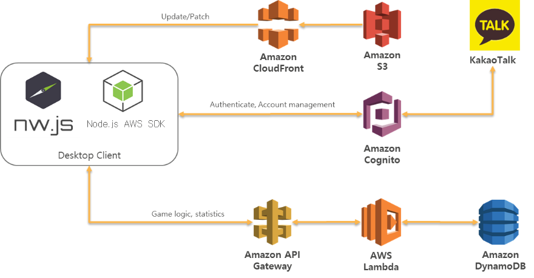

필수 준비 사항
==============

AWS 계정
--------

본 워크샵을 진행하려면 AWS 계정을 준비해야 합니다. AWS IAM, S3, DynamoDB,
Lambda, API Gateway, Cloudfront 및 Cognito에 접근할 수 있어야 하며, 본 가이드는
한명이 하나의 AWS 계정을 사용한다고 가정합니다. 다른 사람과 계정을 공유할 경우
특정 리소스에 대해 충돌이 발생하므로 권장하지 않습니다.

본 워크샵의 일환으로 사용하는 모든 리소스는 AWS계정이 생성된지 12개월 미만일
경우 제공되는 AWS 프리티어로 사용 가능합니다. 프리티어 사용량을 넘어서거나
프리티어가 만료될 경우 과금이 될 수 있습니다. 따라서 새로운 실습용 계정을 만드는
것을 권장합니다. 자세한 내용은 [AWS 프리티어
페이지](https://aws.amazon.com/ko/free/)를 참조하십시오.

카카오 디벨로퍼 계정
--------------------

카카오톡 인증 연동을 위하여 KakaoTalk Developer 계정이 필요합니다. 상세한 내용은
[Kakao Developers 페이지](https://dev.kakao.com/)를 참조하십시오.

텍스트 에디터
-------------

설정 파일의 업데이트를 하기 위하여 로컬 텍스트 편집기가 필요합니다.

NW.JS
-----

본 워크샵에서 사용하는 데스크탑 애플리케이션은 NW.JS로 구현되었습니다. nwjs.io 에서 NW.JS를 다운받아 설치합니다. 이 애플리케이션은 v0.25.0에서 개발되고 테스트되었습니다.

실습 모듈
=========

이 워크샵은 세 가지 실습 모듈로 나뉩니다. 다음 단계로 진행하기 전에 각 모듈을
완료하여야 합니다. 워크샵을 마친 후에는 자원 삭제 가이드에 따라 생성된 모든
리소스를 삭제할 수 있습니다.

-   [Lab1. Cognito를 이용하여 카카오톡
    연동하기](#lab1.-cognito를-이용하여-카카오톡-연동하기)

-   [Lab2. S3와 Cloudfront로 클라이언트 배포 서비스
    제작하기](#lab2.-S3와-Cloudfront로-클라이언트-배포-서비스-제작하기)

-   [Lab3. DynamoDB와 stream을 이용한 플레이데이터 저장 및
    통계](#lab3.-dynamodb와-stream을-이용한-플레이데이터-저장-및-통계)

리전 선택
---------

이 실습은 다음 서비스를 지원하는 모든 AWS 리전에 배포할 수 있습니다.

-   Amazon Cognito

-   AWS Lambda

-   Amazon API Gateway

-   Amazon S3

-   Amazon DynamoDB

-   Amazon Cloudfront

AWS 설명서에서 리전 표 를 참고하여 지원되는 서비스가 있는 지역을 확인할 수
있습니다. 지원되는 지역중에서는 N. Virginia, Ohio, Oregon, Ireland, Frankfurt,
Tokyo, Sydney, Seoul 이 있습니다.

Lab1. Cognito를 이용하여 카카오톡 연동하기
===========================================

이 모듈에서는 KakaoTalk과 Cognito를 이용하여 인증 서비스를 구성합니다.
KakaoTalk에서 OpenID를 지원하지 않기 때문에, OAuth 2.0표준을 통하여 Custom
Source로 Cognito와 연동할 수 있습니다. OpenID나
Google,Twitter,Facebook,Amazon,Digits의 경우에는 Cognito Console에서 더욱
간단하게 인증 연계가 가능합니다. KakaoTalk javascript API는 webserver를 통한
loading만을 허용하기 때문에 Desktop application에서 웹서버 없이 사용할 수 없고,
RESTful API 역시 KakaoTalk API의 CORS설정으로 인해 Desktop application에서
구현할 수는 없습니다. 따라서, 이 실습에서는 Amazon Simple Storage Service(S3)의
정적 웹페이지 호스팅 기능을 이용하여 Kakaotalk 인증을 중개하도록 구성합니다.
만일 Mobile Application이나 웹앱이라면 S3 정적 웹페이지 호스팅 과정 없이 Kakao
API와 AWS SDK를 사용하여 연계가 가능합니다.

Kakao Login을 사용하는 로그인 과정은 다음과 같은 흐름을 가지게 됩니다.

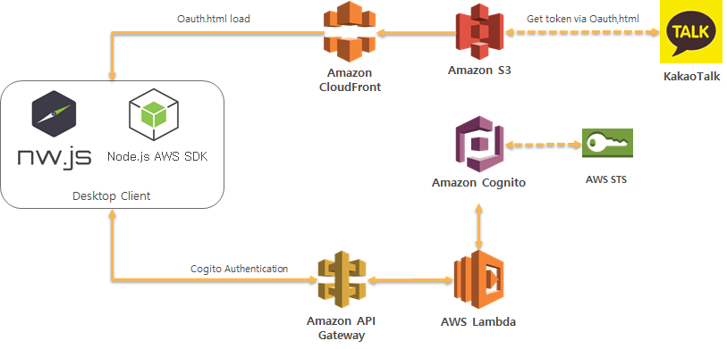

사용자는 oauth.html의 javascript를 통하여 Kakao Login을 요청하여 Key를 발급받고,
필요정보를 AWS API Gateway로 전달합니다. API Gateway는 들어온 정보를 가지고
Lambda를 호출합니다. Lambda함수는 Kakao Login에서 전달받은 Key 정보의 정합성을
확인하고 올바른 키의 경우 Cognito에 Cognito Token 을 요청합니다. Token이
발급되면 API Gateway를 통해 response를 반환하게 됩니다. 이제 사용자는 Cognito
ID와 Token을 가지고 해당 세션에 Cognito를 통한 Credential을 할당 받고 정의된
Role의 권한이 허용하는 AWS 서비스를 활용할 수 있게 됩니다.

S3 및 Cloudfront 생성하기
-------------------------

이 실습에서 Kakaotalk 연동을 위한 oauth.html과 클라이언트 리소스 업데이트를 위한
origin으로 S3서비스를 사용합니다. 이 단계에서는 S3 bucket과 Cloudfront
Distribution을 생성합니다.

### S3 Bucket생성하기

1.  AWS Management Console 에서 Services 를 선택한 다음 S3 를 선택하십시오.

2.  **+Create Bucket** 을 선택하십시오.

3.  gamingonaws-yourname 와 같은 전 세계적으로 고유한 이름을 설정하십시오.

4.  드롭다운 메뉴에서 이 실습에서 사용할 리전을 선택하십시오.

    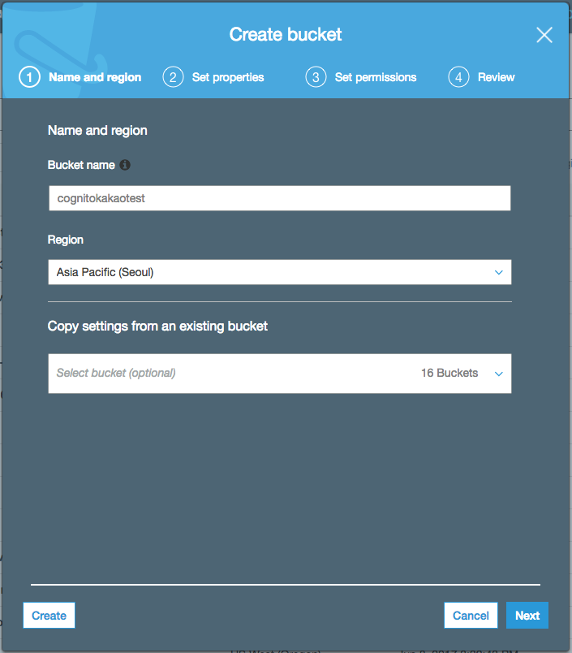

5.  Next를 누르고 Versioning을 활성화합니다. (이후 Client update/patch에서 S3
    Versioning기능을 활용합니다.)

    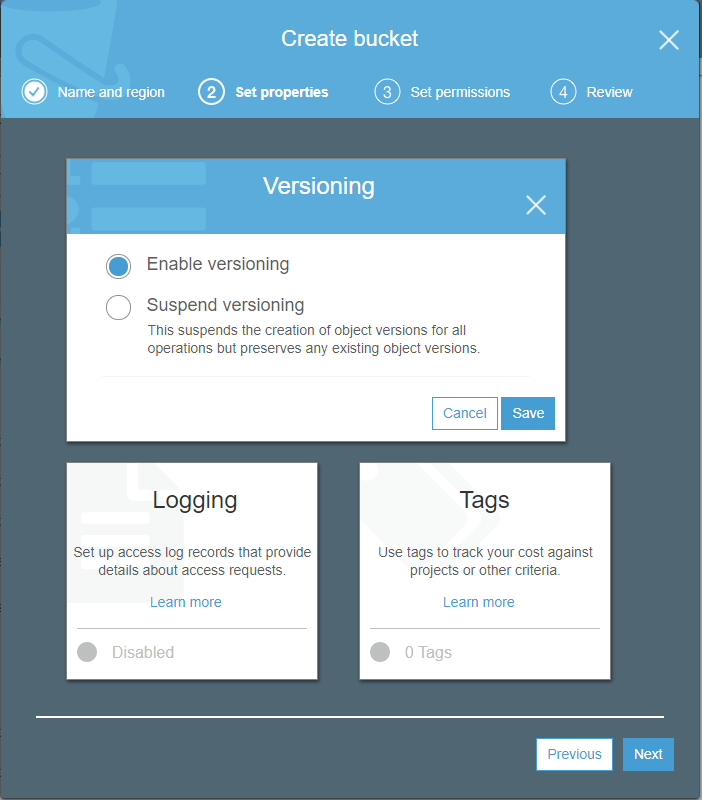

6.  Next를 누르고 Set Permissions 텝에서 “Grant public read access to this
    bucket”을 선택합니다. 이후 기본 값으로 Bucket을 생성합니다.

    

7.  생성된 버킷의 Properties Tab에서 Static website hosting을 활성화합니다.

    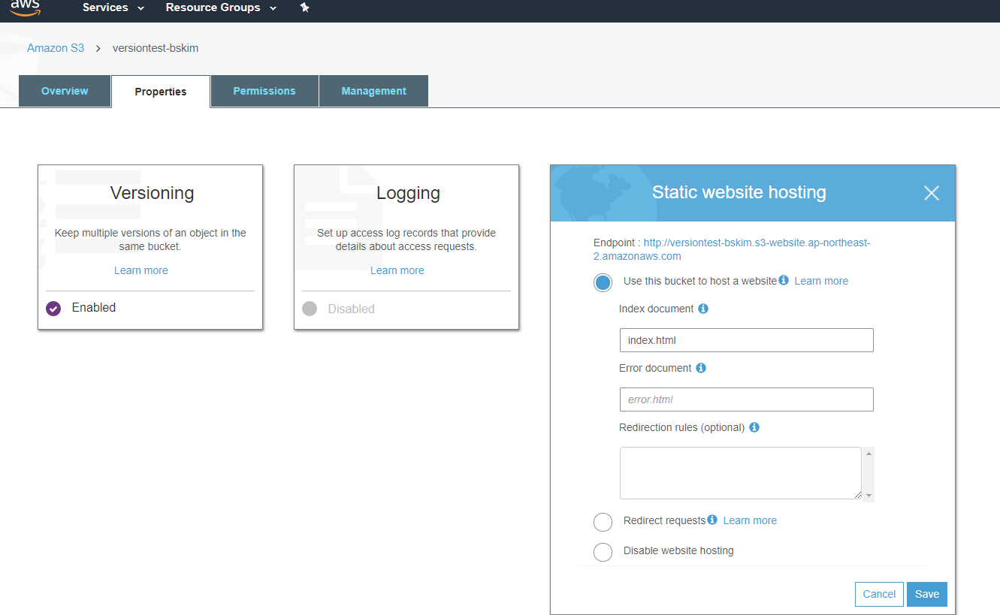

### Cloudfront Distribution 생성하기

1.  AWS Management Console 에서 Services 를 선택한 다음 Cloudfront 를
    선택하십시오.

2.  Create Distribution 버튼을 클릭하여 Distribution을 생성합니다.

3.  Delivery method로 Web을 선택하십시오

    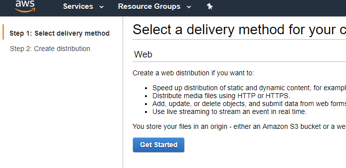

4.  Origin Domain Name으로 위에서 생성한 Bucket을 설정합니다.

    

5.  Query String Fowarding and Caching을 Forward all, cache based on whitelist로 선택하고, Query String Whitelist에 **versionId**라고 입력합니다. (이후 Client resource update/patch에서 해당 기능을 사용합니다.)

    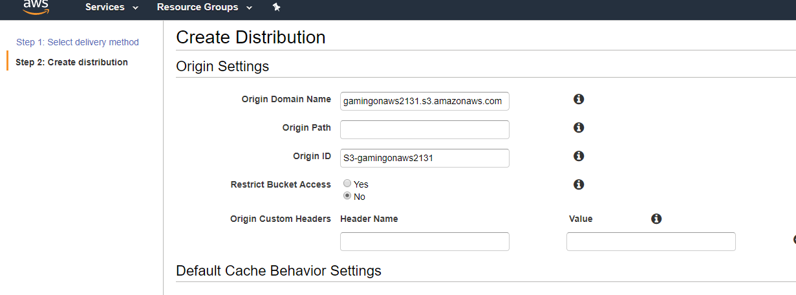

6.  Create Distribution 버튼을 클릭하여 Cloudfront distribution을 생성합니다.
    Distribution 생성에는 시간이 걸리므로 바로 다음 단계로 진행합니다.

카카오 개발자 등록 및 애플리케이션 설정하기
-------------------------------------------

1.  Kakao Login을 비롯한 KakaoTalk 연동을 위해서는 Kakao 개발자 등록을 해야
    합니다. Kakao 계정을 가지고 있으면 손쉽게 개발자 등록을 마칠 수 있습니다. 이
    과정은 [Kakao의 개발자 웹포털](https://dev.kakao.com/)을 통해 진행할 수
    있습니다. 개발자 등록을 마치고 개발자 포털에서 앱 개발 시작하기 버튼을
    클릭하면 앱개발을 위한 페이지로 이동합니다.

    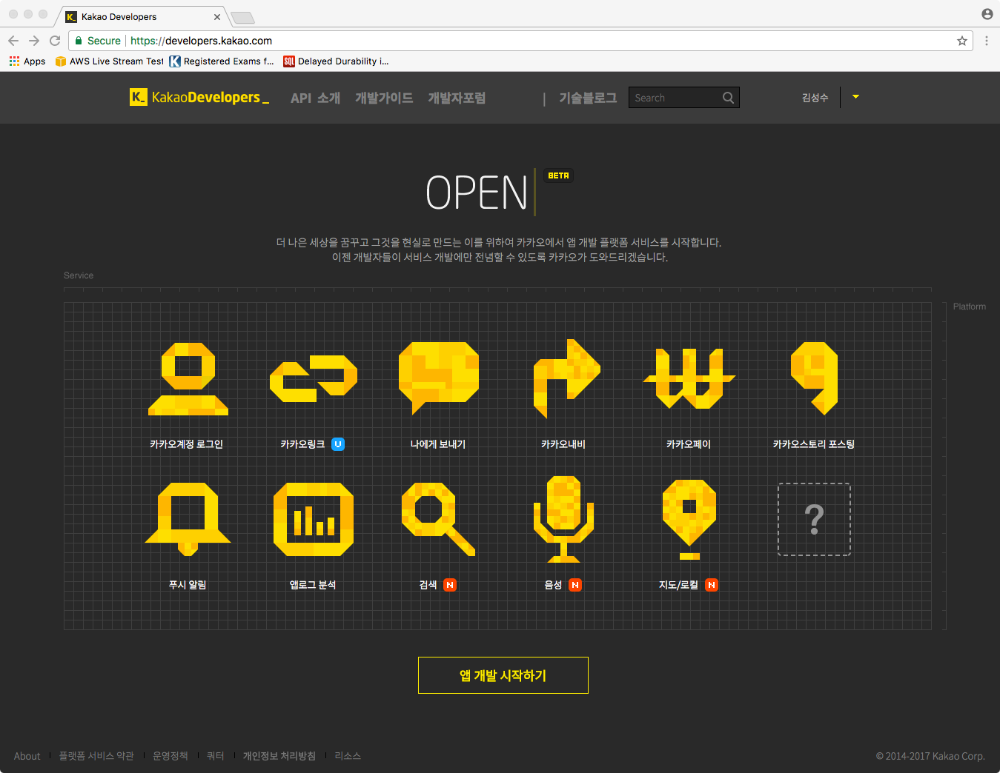
    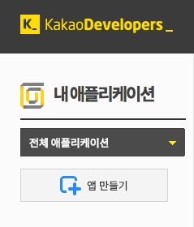

2.  앱 만들기 버튼을 클릭하고 적정한 이름을 지정하면 Kakao용 앱을 만들 준비가
    완료됩니다.

3.  App을 생성한 뒤 애플리케이션을 선택하면 각종 애플리케이션 정보를 확인할 수
    있습니다. 여기에서 앱정보 항목의 앱키를 선택해서 생성된 Kakao의 Application
    Key를 기록해둡니다. 이 키는 여러분의 애플리케이션 및 Lambda함수에서 사용될
    예정입니다.

    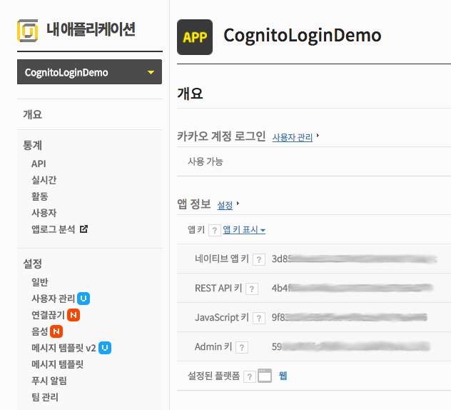

4.  카카오쪽에서는 애플리케이션의 인증 도메인을 확인합니다. 이를 위하여
    애플리케이션의 설정/개요 항목에서 앰정보 항목의 “설정된 플랫폼”을 통해 어떤
    웹앱/모바일앱에서 인정 요청을 할 수 있는지 지정하게 됩니다. 사이트
    도메인으로 위에서 생성한 Cloudfront distribution 의 domain name을
    입력합니다. 이때, http와 https 두가지 모두 입력해 둡니다.

    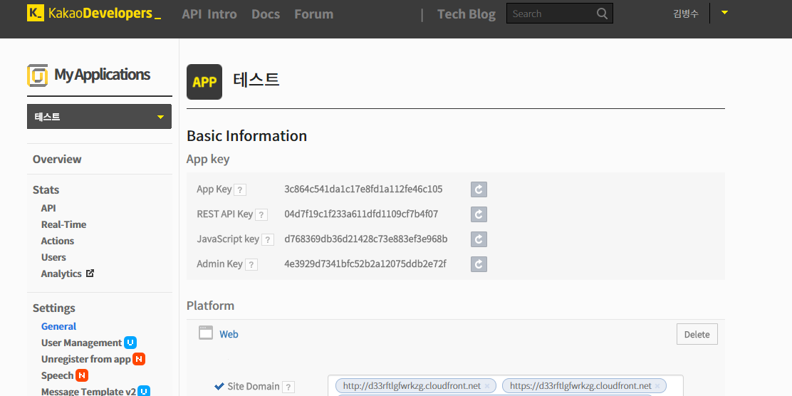
    

5.  카카오 로그인을 활성화합니다. 좌측 설정 메뉴에서 사용자 관리 메뉴를 클릭하여 사용자 관리를 활성화합니다.

    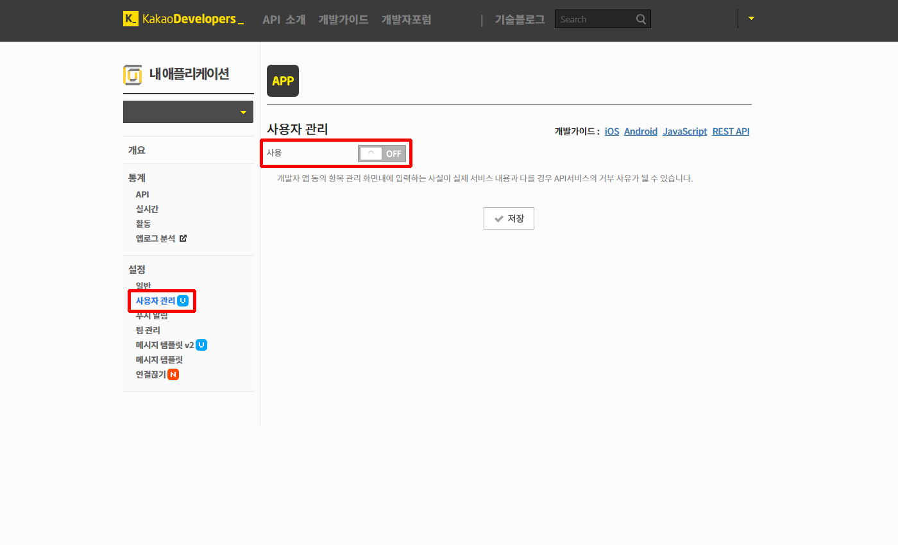

6.  개인 정보보호항목에서 수집목적을 입력해야 합니다. (간편로그인 연동 등.) 입력하지 않으면 활성화가 되지 않습니다.( **"사용자 관리 수정에 실패했습니다."** 라는 에러가 발생합니다.) 사용자 프로필 정보만 수집하는 것으로 하고 수집목적을 입력합니다.

    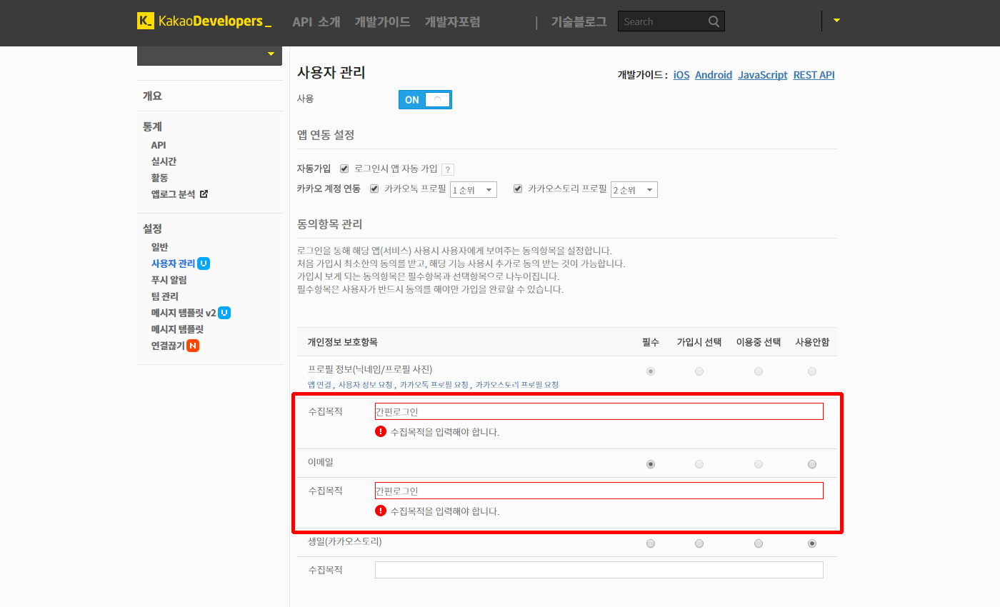


Cognito 생성하기
----------------

1.  AWS Console에서 Cognito를 선택합니다.

    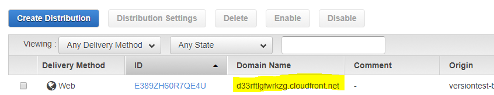

2.  Kakaotalk 연계를 위하여 Federated Identity를 생성하여야 합니다. 오른쪽의 Manage Federated Identity를 선택합니다.

3.  첫 페이지에서 Identity Pool name을 gamingonaws로 지정하고, Create Pool을 눌러    Identity Pool을 생성해줍니다.

    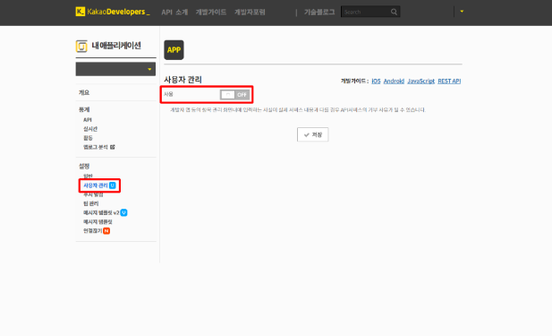

4.  Pool을 생성하면 간단한 샘플 코드를 볼 수 있는 화면으로 이동합니다. 여기에서 화면 상단 우측의 Edit Identity Pool링크를 클릭합니다. Dashboard의 Edit identity Pool로도 이동할 수 있습니다. 

    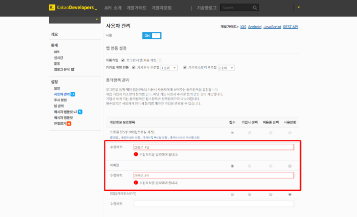

    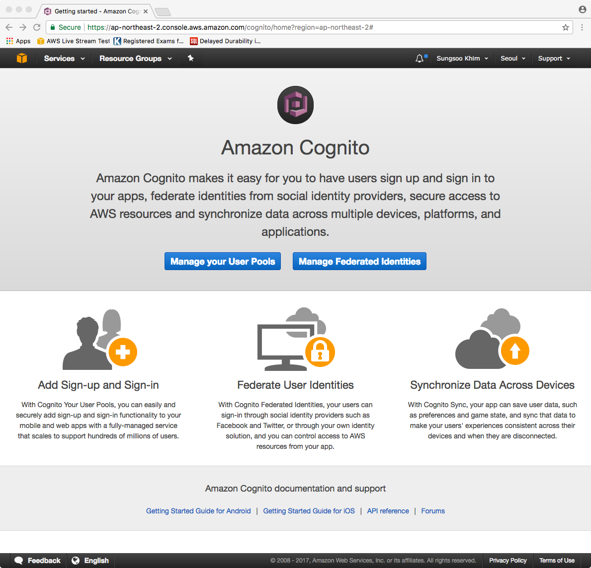

5.  여기서 Identity Pool의 각종 설정사항을 편집할 수 있습니다. 우선 Unauthenticated role, Authenticated role의 이름을 확인합니다. 이 role에 이후 필요한 권한들을 추가할 것입니다. 또한, Identity Pool ID의 이름을 기록해 둡니다. 이후 설정에 필요합니다.

    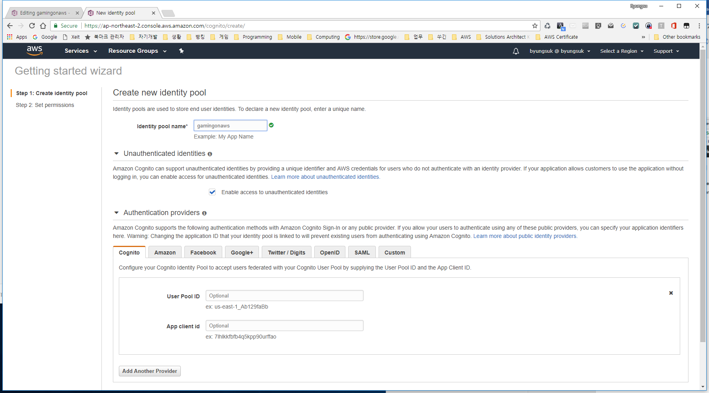

6.  아래 Authentication Providers 항목을 설정합니다. Kakao Login은 Open ID를 지원하지 않기 때문에 Custom 항목으로 인증을 처리해야 합니다. Custom Tab을 열고 Developer Provide Name을 gamingonaws.auth로 지정한 후 저장합니다.

    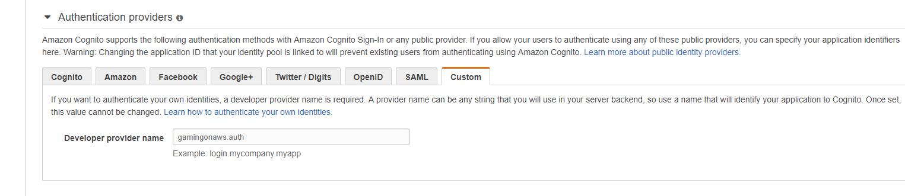

Lambda 및 API Gateway 생성하기
------------------------------

Cognito 및 Kakao 인증을 처리하기 위한 Lambda 함수와 API Gateway를 생성합니다.

### Lambda 함수 생성하기

1.  AWS Management Console에서 Lambda를 선택합니다. Author from scratch로
    빈함수를 생성합니다.

    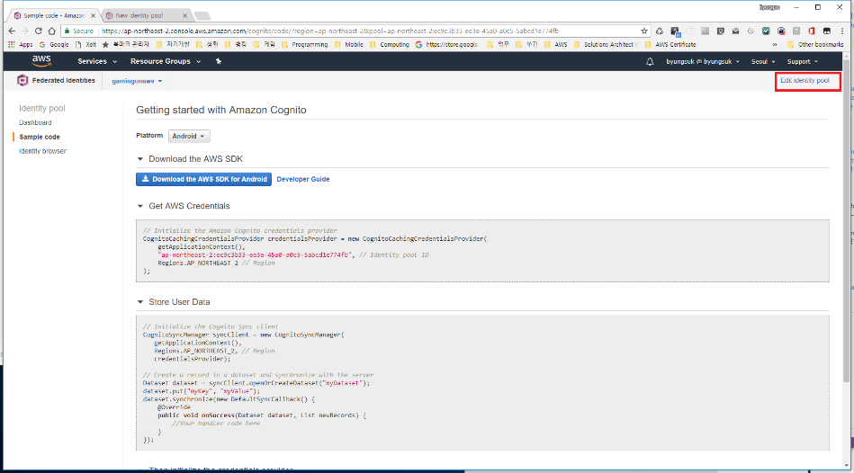

    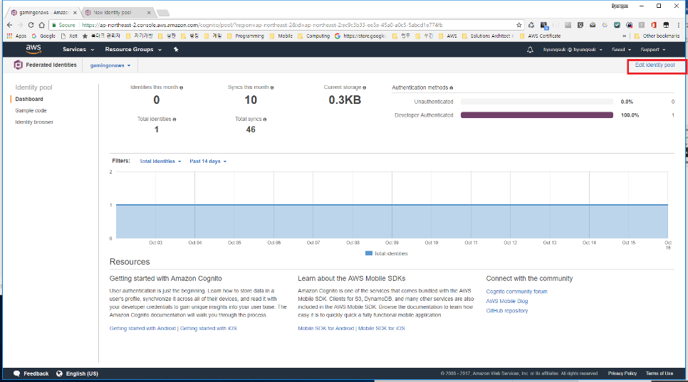

2.  Role은 Create a custom role을 선택하여 Lambda에 부여할 IAM role을
    설정합니다.

    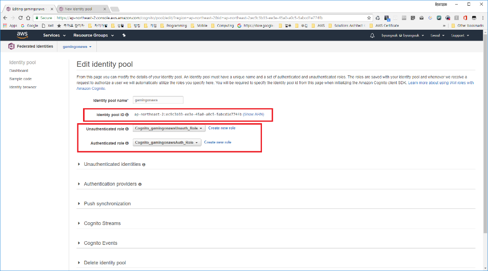

    

3.  View Policy Document를 클릭하고 Edit를 선택하여 다음과 같이 Cognito 인증을
    위한 권한을 추가합니다.

4.  생성된 Lambda 함수에서 Triggers Tab에서 Add trigger로 API Gateway를
    지정합니다.

    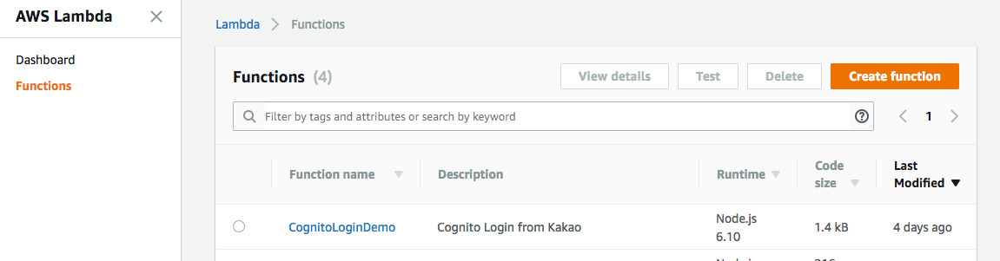

5.  API name을 Enter value 버튼을 클릭하여 지정하고, Security는 Open으로
    지정합니다. (실제 서비스에서는 보안 강화를 위하여 Secret Key나 IAM을
    사용하도록 설정할 수 있습니다.)

    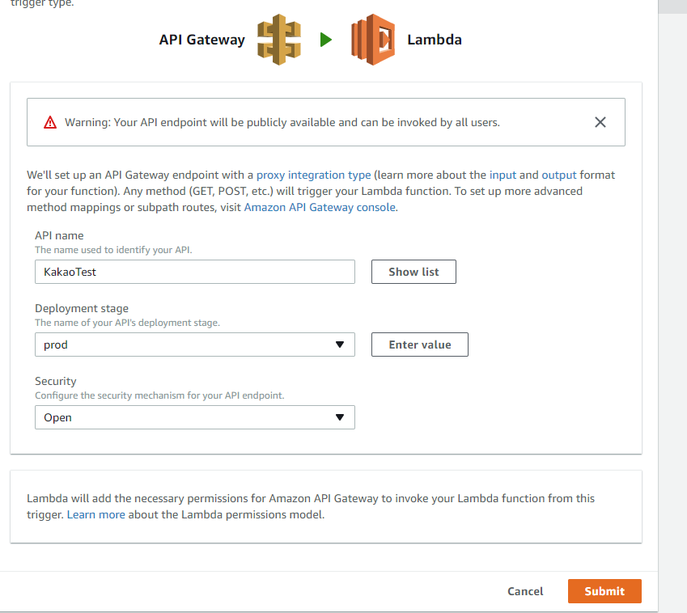

6.  다시 Configuration Tab으로 돌아와 아래 코드를 입력합니다. 아래 코드에서 <identity-pool-id>를 위 단계에서 기록해둔 ID로 대체합니다. 만일 developer provider name도 gamingonaws.auth가 아닌 다른 이름으로 지정하였다면 해당 이름으로 변경합니다.

```javascript
var AWS = require('aws-sdk');
var cognitoidentity = new AWS.CognitoIdentity();

exports.handler = (event, context) => {
  // Sample code to act as auth server with Kakao Login

  var authInfo  = require('querystring').parse(event.querystring);

  var userid = authInfo['id'];
  var access_token = authInfo['access_token'];
  var expires = authInfo['expires_in'];

  var http = require('https');

  var options = {
    host: "kapi.kakao.com",
    path: "/v1/user/access_token_info",
    headers: {"Authorization": "Bearer "+ access_token}
  };

  console.log("start Kakao auth confirm");

  http.get(options, function(res) {
    console.log("Got response:" + res.statusCode);
    if (res.statusCode == 200) {
      // Only enter here when Kakao gave us a confirmation

      var kakaoresponse = "";
      res.on("data", function(chunk) {
        kakaoresponse += chunk;
      })
      res.on("end", function() {
        var obj = JSON.parse(kakaoresponse);

        var useridfromkakao = obj.id;
        var expireinMillis = obj.expireinMillis;
        var appId = obj.appId;

        var params = {
          IdentityPoolId: '<identity-pool-id>', /* required */
          Logins: { /* required */
            'gamingonaws.auth': useridfromkakao.toString()
          }, 
          TokenDuration: 1000
        };
        console.log("userid" + useridfromkakao);
        console.log(expireinMillis);
        console.log(appId);
        cognitoidentity.getOpenIdTokenForDeveloperIdentity(params, function(err, data) {
          if (err) console.log(err, err.stack); // an error occurred
          else {
            console.log(data);           // successful response
            context.done(null, data);
          }
        });
        // End of Cognito call
      });
    } else {
      // Because KAKAO returned 400 or 401 error - means auth check failed 
    }
  });
};
```
이 코드는 사용자의 Kakao정보를 전달 받으면, 해당 정보의 Validity를 Kakao에 확인하는 코드입니다. 만일 인증이 되면 Cognito에 사용자 Token을 발급하고, 해당 정보를 클라이언트에 전달합니다. 실패하는 경우에는 Fail을 돌려주게 됩니다.

만일 함수의 실행에 관련된 로그를 확인하고 싶을 경우에는 console.log()함수를 통해 로그를 하시고 CloudWatch를 통하여 로그 내용을 확인 하실 수 있습니다. 이 함수는 실습을 위한 최소 기능만 구현한 함수이므로 참조로만 활용하실 것을 권합니다.

### API Gateway 생성하기

1.  Lambda 함수 생성시 Trigger로 생성한 API Gateway항목을 설정하기 위하여 AWS
    Management Console에서 API Gateway항목으로 이동하거나 Lambda의 Triggers
    Tab에서 링크를 클릭하여 이동합니다.

    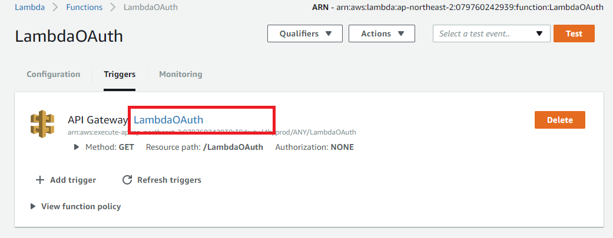

2.  API Gateway항목의 Resource의 Dropdown메뉴에서 Create method 항목을
    선택합니다.

    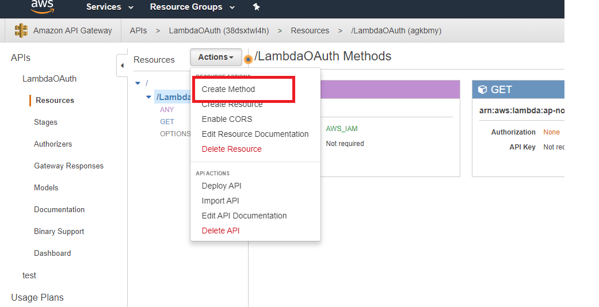

3.  Dropdown 메뉴에서 먼저 OPTIONS 메소드를 추가합니다. OPTIONS에서는
    Integration Type을 Mock으로 선택합니다. Mock 형태이므로 이대로 저장하면
    됩니다.

    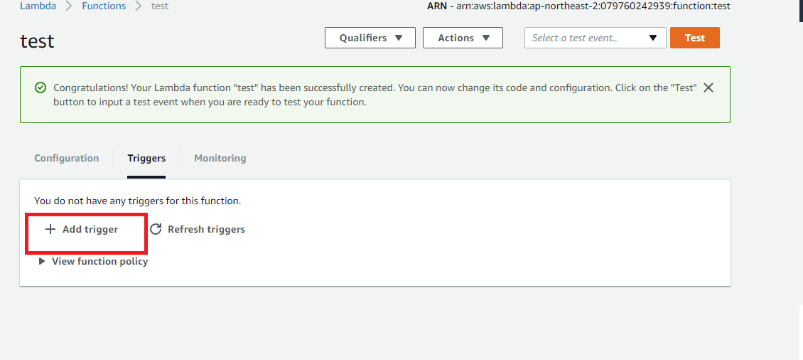

4.  마찬가지로 GET method를 추가합니다. Integration Type을 Lambda로 선택하고,
    Region은 Lambda함수를 생성한 Region을 선택합니다. Seoul을 선택하였다면
    ap-northeast-2가 됩니다. Lambda Function은 위에서 생성한 함수 이름을
    입력하고 저장합니다. (자동완성을 지원합니다.)

    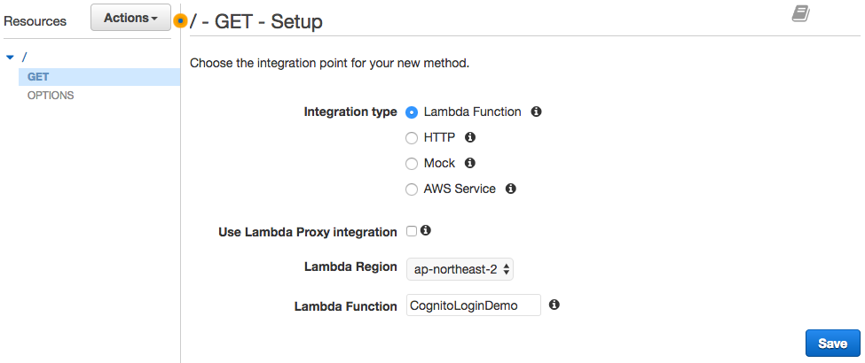

5.  이제 GET method의 상세 사항을 설정하겠습니다. GET method를 선택하여
    Integration Request 항목을 클릭합니다.
    
    

6.  하단의 Body Mapping Template 항목을 열고 Add mapping template을 눌러 새로운
    Mapping을 추가합니다. Content-Type은 application/json을 입력합니다. 추가할때
    아래와 같은 경고창이 나오면 No, use current settings를 선택해줍니다. 그러면
    아래와 같이 Template를 입력하는 창이 나옵니다.

    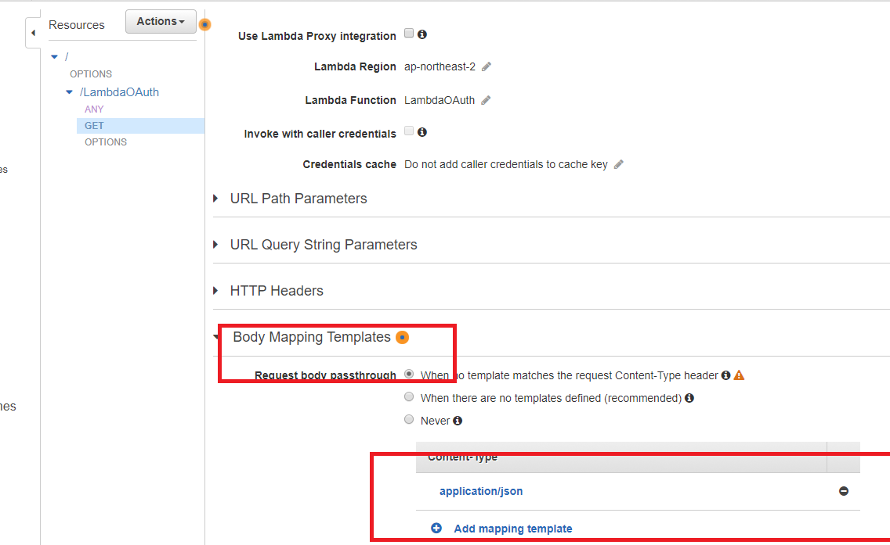

    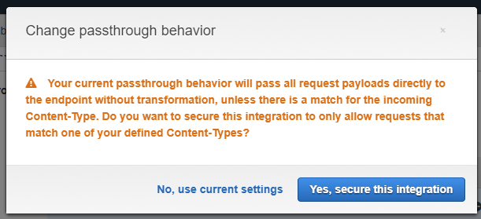

    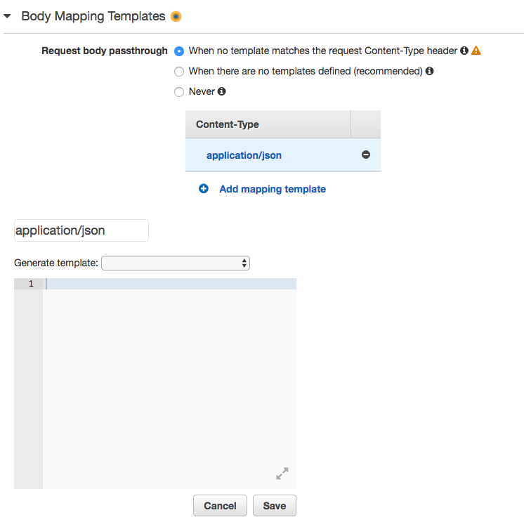

7.  여기에 아래 코드를 입력하고 Save를 누릅니다.
```javascript
{
    "querystring" : "#foreach($key in $input.params().querystring.keySet())#if($foreach.index > 0)&#end$util.urlEncode($key)=$util.urlEncode($input.params().querystring.get($key))#end",
    "body" : $input.json('$')
}
```
-   이 코드는 API Gateway로 전달되는 GET Request에 대하여 Lambda에
    querystring이라는 변수로 전달하는 Template입니다. 이후 조금 더 정교하게
    수정을 하고 싶을 경우에는 Template언어가Apache의 [Velocity Project의
    Velocity Template
    Language](http://velocity.apache.org/engine/devel/vtl-reference.html)이므로
    관련 정보를 참고하시면 됩니다.

8.  마지막으로 이 API Gateway를 애플리케이션에서 호출할 수 있도록 CORS(Cross
    Origin Resource Sharing)설정을 하도록하겠습니다. Actions 메뉴에서 Enable
    CORS를 선택합니다.

    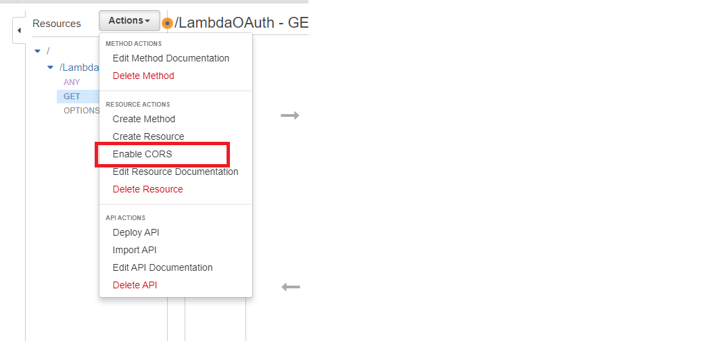

9.  기본값으로 Enable CORS and replace existing CORS headers 버튼을 눌러
    설정합니다.

    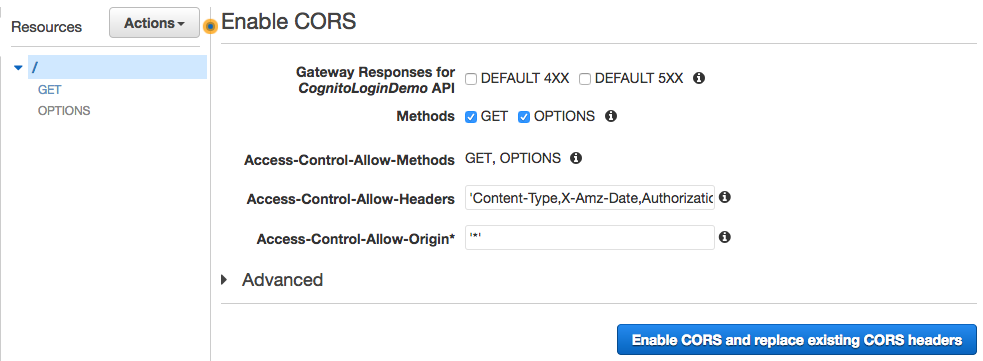
    

10.  이제 API를 Deploy합니다. Action menu에서 Deploy API항목을 선택하고
    Deployment stage는 prod를 선택하여 Deploy합니다.
    
    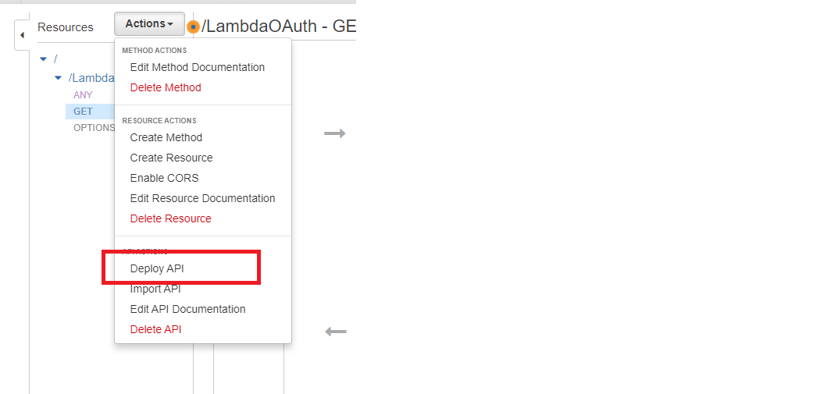

11.  Deploy가 완료되면 API Gateway의 Invoke URL이 나옵니다.
    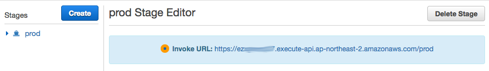

12.  Invoke URL을 기록해둡니다. (만약 API를 root가 아닌 별도의 resource path로
    설정하였다면, /prod 뒤에 해당 API의 resource path까지 붙여서 기록해둡니다.)

카카오 인증 테스트하기
----------------------

### 웹에서 테스트

1.  제공된 Source code의 root directory의 oauth.html과 script 폴더의 OAuth.js를 위에서 생성한 S3 Bucket에 업로드하여야 합니다. 업로드하기전에 OAuth.js를 먼저 편집합니다. API_URL은 API Gateway Invoke URL + resource path 형태로 설정하시거나 Lambda 함수의 trigger 항목에서 method항목을 펼치면 나오는 invoke URL을 사용하여 설정합니다.
``` javascript
var CONFIG = { 
    "KakaoAppId":"<Kakao Javascript AppKey>", 
    "API_URL":"<API Gateway prod enpoint URL(+resource path if not root)>" 
} 
```

2.  S3 bucket의 root 경로에oauth.html을, script 폴더를 생성하고 해당 폴더에
    수정한 OAuth.js를 업로드합니다.

3.  browser에서 cloudfront domainname/oauth.html 로드합니다.

4.  카카오계정으로 로그인 버튼을 눌러 Token 발급 및 필요정보들이 출력되는지
    확인합니다.

    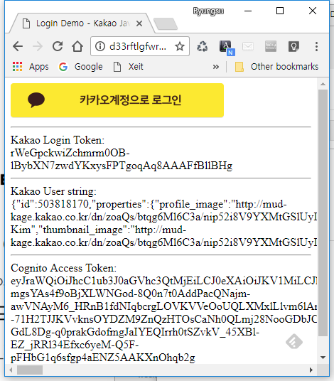

5.	만약 설정 등의 문제로 OAuth.js파일을 수정하여 다시 업로드 할 경우 Cloudfront에 이미 caching된 OAuth.js로 인해 수정사항이 바로 적용되지 않습니다. Cloudfront distribution detail에서 Invalidation 항목에서 Create invalidation 버튼을 클릭하고 /script/OAuth.js 를 입력하여 cache된 OAuth.js를 invalidate시키고 invalidation이 완료되면 다시 테스트를 진행합니다.

### NW.JS로 테스트

1.  nw_app 폴더로 이동합니다.

2.  Script 폴더의 config.json을 열어 필요항목을 편집합니다.

```json
{ 
    "bucketname":"<s3 bucket name>", 
    "uploadprefix":"update", 
    "region":"ap-northeast-2", 
    "api_url":"<api_gateway prod endpoint url(+method name if specified>",
    "IdentityPoolId":"<cognito Identity Pool ID >", 
    "cloudfrontDistributionId":"<cloudfrontDistributionId(not domain name, randomized string id)>",
    "cloudfrontURL":"http://<cloudfrontdomaindanme>" 
}
```

3.  Cmd / terminal창에서 nw_app 폴더로 이동하여 다음과 같이 커맨드를 입력합니다.
    (여기서는 nw_app과 같은 depth의 nwjs-sdk 폴더에 nwjs파일을 압축해제하였다고
    가정합니다. Mac의 경우, nwjs를 nwjs.app/Contents/MacOS/nwjs . 와 같이
    실행합니다.

    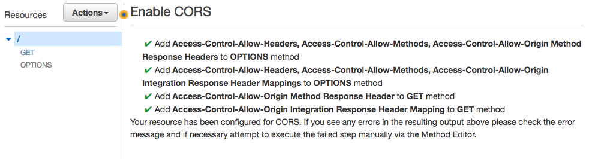

4.  Desktop Application에서 카카오 인증을 진행하고 결과를 확인합니다.

    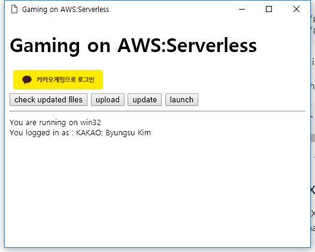

Lab2. S3와 Cloudfront로 클라이언트 배포 서비스 제작하기
=======================================================

시나리오
--------

게임서비스에서는 지속적인 게임 클라이언트의 배포 및 업데이트가 필요합니다. 이
실습에서 클라이언트 업데이트 과정은 다음과 같습니다.

1.  nw_app 폴더에 새 클라이언트 리소스를 추가하면, nw_app에서 file들의
    checksum을 확인하여 업데이트 여부를 체크하고 업데이트된 파일들을 S3에
    업로드합니다.

2.  이미 S3 생성시에 versioning기능을 설정하였으므로 각 object들의 변경사항은
    version별로 S3에 기록되게 됩니다.

3.  nw_app에서는 S3업로드시 반환받은 version_id를 metadata로 생성하여 S3에
    업로드합니다.

4.  업로드가 완료되면 cloudfront distribution 의 version.json파일(만)
    invalidation하여 클라이언트 배포를 마치게 됩니다.

5.  클라이언트에서 버전을 체크할 때 version.json을 받아 각object의 version_id를
    포함하여 cloudfront에 요청합니다.

6.  Cloudfront distribution 생성시에 이미 versionId query string을 origin에
    포워딩하고 query string을 포함하여 캐싱하도록 설정하였으므로 cloudfront는 각
    object의 최신 version_id로 object를 다운로드 받게 됩니다.

여기서는 실습의 편의를 위하여 KakaoTalk 로그인 사용자가 클라이언트 패치를
생성하고 업로드할 수 있는 관리자인 것으로 상정합니다. 실제 게임 서비스에서는
클라이언트 패치 생성 및 업로드 권한을 분리하거나 별도의 애플리케이션으로
제작하여야 합니다. 또한 실제 서비스에서 비용 절감 및 성능 향상을 위하여 사용할
수 있는 파일 버전별 binary diff 생성을 통한 differential patch 등의 기능이나
리소스를 강제 삭제하거나 클라이언트 업데이터의 자체 패치 등 고급기능은 여기서
다루지 않습니다.

IAM Role에 권한 추가하기
------------------------

Cognito 인증 사용자에게 필요한 권한을 추가하는 작업이 필요합니다. 단계별 지침은
다음과 같습니다.

1.  AWS management console의 Services에서 IAM을 선택합니다.

2.  왼쪽 메뉴에서 Roles 메뉴를 선택합니다.

3.  Role name중 Cognito 생성시에 함께 생성된 Coginto_XXX_Auth_role을 선택합니다.

    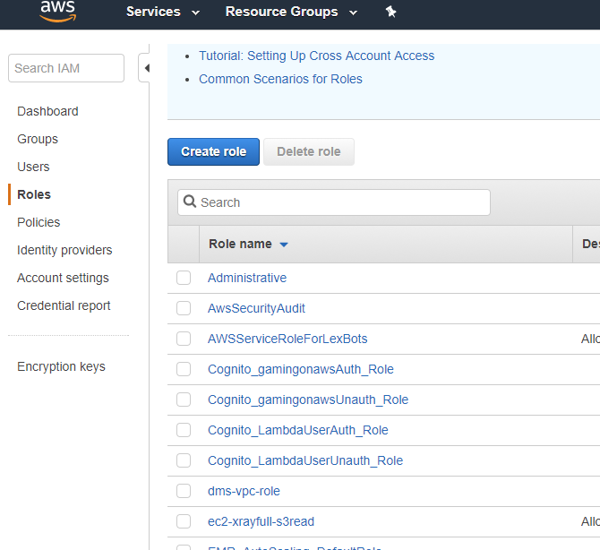

4.  Permission Tab에서 policy를 확장하고 Edit policy버튼을 눌러 다음 코드를
    입력합니다. 코드 입력시에 <bucket_name>항목을 생성한 bucket이름으로
    설정합니다.

    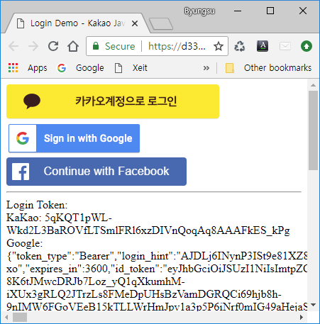
```json
{
    "Version": "2012-10-17",
    "Statement": [
        {
            "Effect": "Allow",
            "Action": [
                "mobileanalytics:PutEvents",
                "cognito-sync:*",
                "cognito-identity:*"
            ],
            "Resource": [
                "*"
            ]
        },
        {
            "Action": [
                "s3:PutObject",
                "s3:PutObjectAcl"
            ],
            "Effect": "Allow",
            "Resource": [
                "arn:aws:s3:::<bucket_name>/*"
            ]
        },
        {
            "Action": [
                "cloudfront:CreateInvalidation",
                "cloudfront:GetInvalidation"
            ],
            "Effect": "Allow",
            "Resource": [
                "*"
            ]
        }
    ]
}
```

5.  Validate policy 버튼을 눌러 문제가 없는지 확인하고 저장합니다.

S3 버킷에 클라이언트 업데이트용 path 추가하기
---------------------------------------------

위에서 생성한 S3 bucket에 클라이언트 배포를 위한 folder를 추가합니다. 여기서는
update라는 path를 사용합니다.

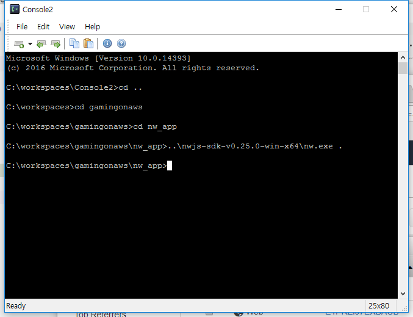

테스트하기
----------

1.  위에서 설정한 nw_app을 실행합니다. Config.json에 cloudfront distribution
    id및 domain name, s3 bucket name이 잘 설정되어 있는지 다시 확인합니다.

2.  nw_app 의 patch 폴더에 client resource 파일 테스트를 위한 임의의 파일 및
    폴더를 구성합니다. 여기서는 test1.txt, test 폴더 생성 후 test2.txt를
    테스트로 사용한다고 가정합니다. 각 test1.txt에는 임의의 내용을 입력합니다.

3.  nw_app 카카오 계정 로그인이 된 상태에서 check updated files 버튼을 클릭하면
    애플리케이션이 patch 폴더 및의 파일과 subfolder들을 탐색하여 업데이트 내용을
    체크합니다. patch 폴더에 version.json파일이 생성된 것을 확인합니다.

    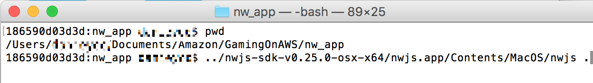
  
    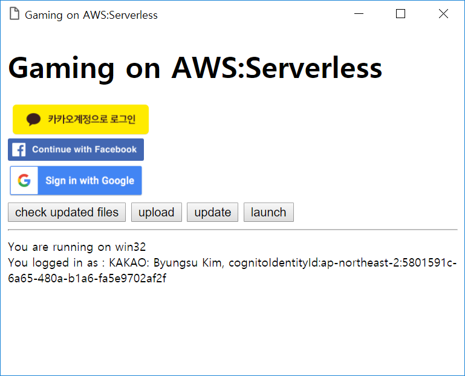

4.  체크가 완료되면 upload 버튼을 눌러 s3에 업데이트된 파일들을 업로드 합니다.
    업로드가 완료되면 Patch 폴더에 filedb.db 파일이 업데이트 된것을 확인합니다.
    이 filedb.db에는 s3에 object를 업로드하면서 확인받은 s3 version_id가
    포함되어 있습니다.

    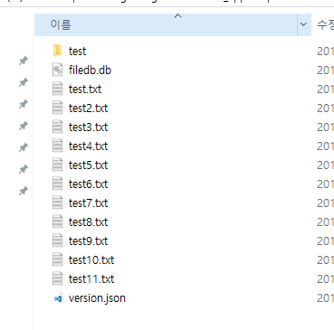

5.  애플리케이션이 자동으로 cloudfront distribution에 version.json파일을
    invalidate 합니다. 이 과정은 10초에서 1분 정도 걸릴 수 있습니다.
    Invalidation이 완료되면 application에 완료 메시지가 출력됩니다.

    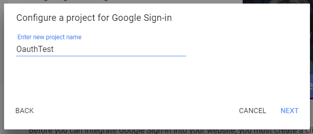

6.  Update 버튼을 클릭하여 version을 체크하고 업데이트된 파일을 다운받습니다.

    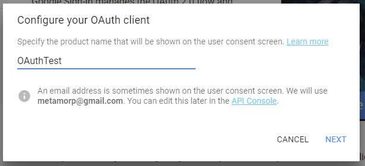

7.  nw_app의 resources folder에서 파일이 업데이트된 것을 확인합니다.

    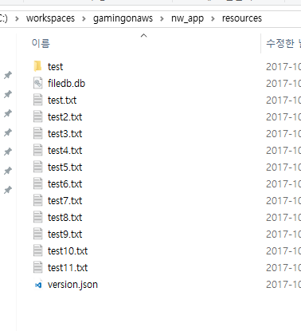

8.  Patch 폴더에 파일을 추가하거나 파일 내용을 변경하여 업데이트된 파일만 패치가
    이루어지는지 확인합니다.

Lab3. DynamoDB와 stream을 이용한 플레이데이터 저장 및 통계
==============================================================

이제 사용자는 게임 클라이언트 업데이트를 마치고 게임을 시작할 수 있게
되었습니다. 사용자의 플레이데이터를 기록하고 DynamoDB Stream을 통해 score 통계를
내는 기능을 구현할 차례입니다. Lambda function과 DynamoDB, API Gateway를
사용하여 기능을 구현해보겠습니다.

IAM role
--------

우선 DynamoDB와 Lambda함수를 만들기 전에 Lambda함수에 적절한 권한을 부여합니다.
앞서 Lambda 함수를 만들 때에는 Lambda함수를 생성하면서 IAM Role도 생성하였지만,
이미 생성한 role을 사용할 수도 있습니다. 여기서는 IAM role부터 생성해보도록
합니다.

게임 스코어를 Put, Get 할 수 있는 2가지 IAM role을 각각 생성합니다.

1.  AWS Management Console에 로그인 한 뒤 IAM 서비스에 접속합니다.

2.  왼쪽 메뉴에서 Roles를 선택합니다.

3.  Create role 버튼을 클릭하여 역할 추가 페이지로 들어갑니다.

    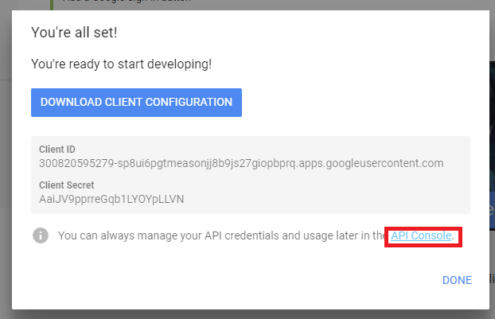

4.  Lambda 서비스를 선택하고, **Next: Permissions** 버튼을 클릭합니다.

5.  **AmazonDynamoDBFullAccess, AWSLambdaDynamoDBExecutionRole** 2가지 역할을
    선택합니다. **Next: Review**를 클릭하여 진행합니다

    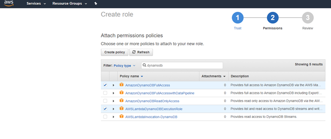

6.  **Role name**에는 gamescore-update-role을 입력한 뒤 **Create role**을
    클릭하여 완료합니다.

7.  위와 같은 방식으로 gamescore-read-role을 생성합니다. 역할은
    **AmazonDynamoDBReadOnlyAccess, AWSLambdaInvocation-DynamoDB** 를
    선택합니다.

    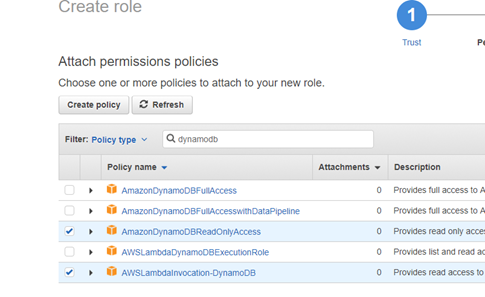

DynamoDB
--------

게임 스코어를 기록하고 히스토리를 확인할 2개의 테이블을 생성합니다.

1.  AWS Management Console에서 DynamoDB 서비스에 접속합니다.

2.  우선 게임 스코어를 기록할 테이블을 생성합니다. Create table을 선택하고 Table
    name은 DemoUserScore, Primary key에는 username을 입력하고 Create를
    클릭합니다.

    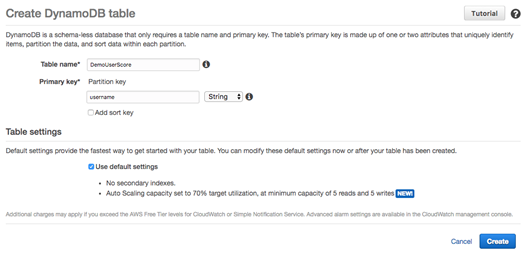

3.  Table 생성이 완료되면 Manage Stream을 활성화합니다. Manage Stream을 선택한
    뒤 View type은 New and old images를 선택하고 Enable을 클릭합니다. 다음과
    같이 Stream이 활성화됩니다.

    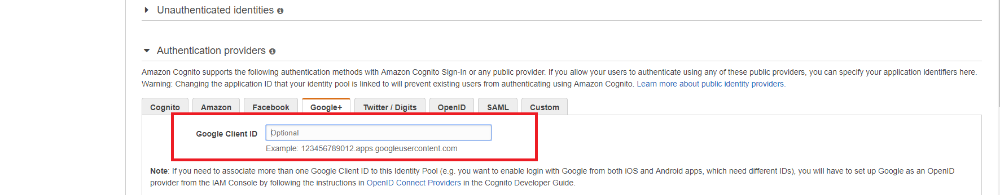

4.  샘플데이터를 생성해줍니다. Items에서 Create item을 클릭합니다.

    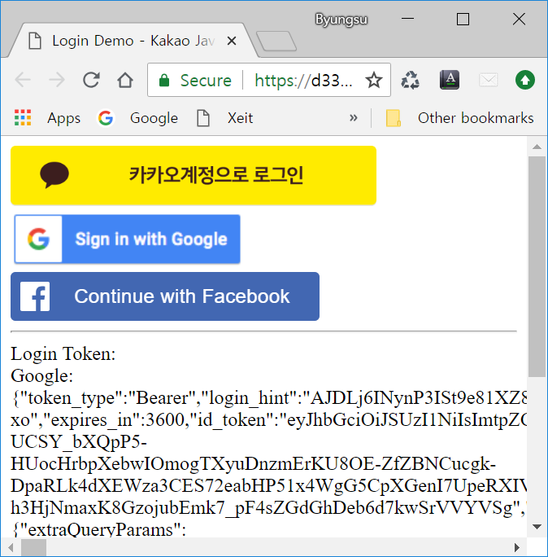

5.  + 버튼을 클릭한 뒤 Append를 선택하고 Number를 선택합니다. 다음과 같이
    입력한 뒤 Save합니다.

    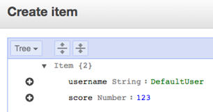

3.  동일한 방법으로 게임 스코어 히스토리를 기록할 두 번째 테이블을 생성합니다.
    Table name은 DemoScoreHistory로 지정하고 Primary key는 score를 Number
    타입으로 생성합니다. Stream을 활성화 할 필요는 없습니다.

    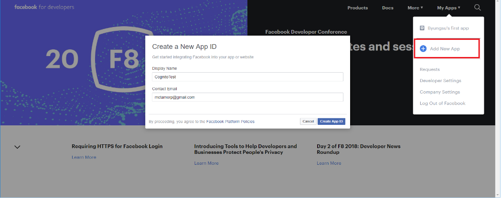

4.  다음의 정보로 Item을 생성해줍니다.

    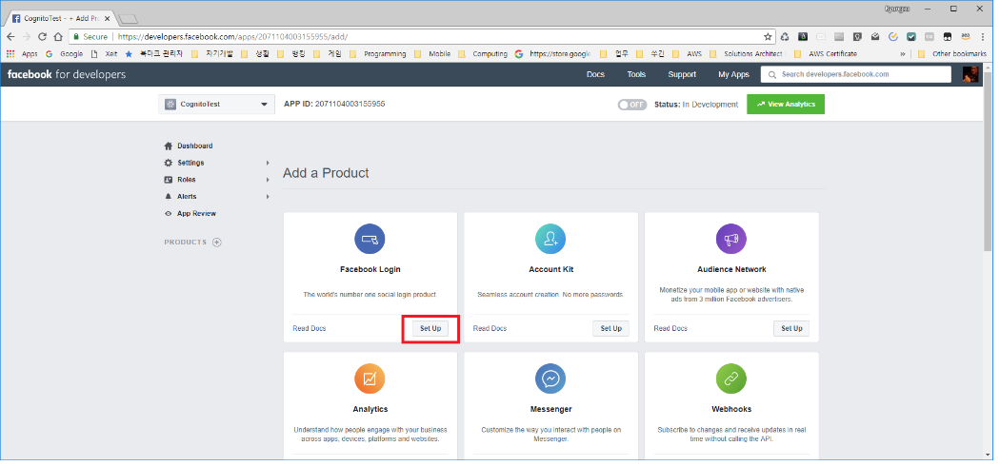

Lambda 함수 설정하기
--------------------

1.  AWS Management Console에서 Lambda 서비스에 접속합니다.

2.  총 4개의 Lambda function을 만들어야 합니다.

3.  Create function 을 선택한 뒤 Author from scratch 버튼을 클릭합니다.

    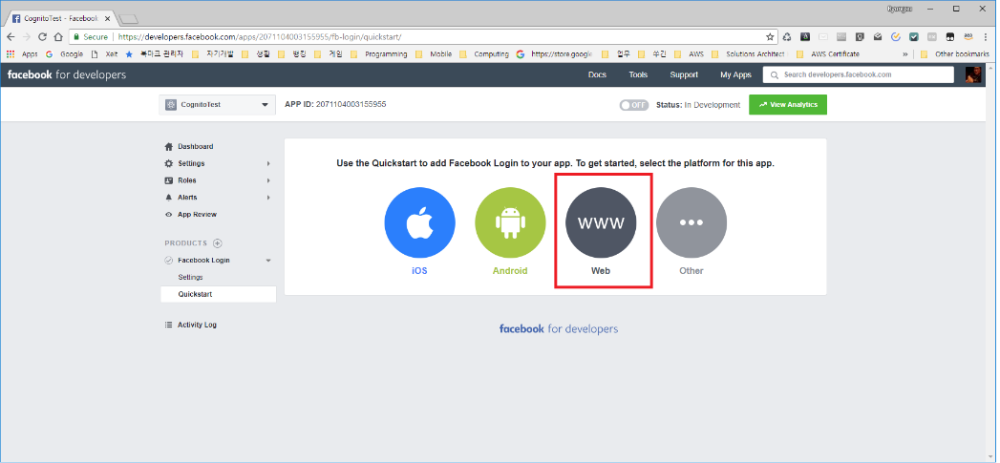

4.  Trigger는 현재 단계에서는 추가하지 않습니다. 바로 Next를 클릭하여 다음
    단계로 진행합니다

5.  첫 번째로 PutUserScore를 생성합니다. 이 함수는 DynamoDB에 게임 스코어를
    업데이트 합니다. Role은 이전 단계에서 생성한 gamescore-update-role을
    사용합니다.

    | Name | PutUserScore 
    | -----|--------------
    | Runtime | Node.js 6.10
    | **Role**| **gamescore-update-role**
    | Timeout  | 1 min 
```javascript
var AWS = require('aws-sdk');
var DOC = require('dynamodb-doc');
var dynamo = new DOC.DynamoDB();

exports.handler = function(event, context){ 
    console.log(JSON.stringify(event.username));


    var cb = function(err, data) {
        if(err) {
            console.log(err);
            context.fail('unable to update users at this time');
        } else {
            console.log(data);
            context.done(null, data);
        }
    };
    
    var item = {
        username: event.username,
        score: event.score
    };
    
    dynamo.putItem({TableName:"DemoUserScore", Item:item}, cb);
    
};
```

6.  두 번째로 GetUserScore를 생성합니다. 이 함수는 DynamoDB의 게임스코어
    데이터를 읽어옵니다. Role은 gamescore-read-role을 사용합니다.

    | Name| GetUserScore            
    |---|---
    | Runtime | Node.js 6.10            
    | **Role** | **gamescore-read-role** 
    | Timeout | 1 min                   
```javascript
var AWS = require('aws-sdk');
var DOC = require('dynamodb-doc');
var dynamo = new DOC.DynamoDB();

exports.handler = function(event, context) {
    var cb = function(err, data) {
        if(err) {
            console.log('error on GetDemoSAInfo: ',err);
            context.done('Unable to retrieve information', null);
        } else {
            if(data.Items) {
                data.Items.forEach(function(elem) {
                console.log( elem.username + ": ",elem.score);
                });
                data.Items.sort(function(a,b) { return parseInt(b.score) - parseInt(a.score) } );
                context.done(null, data.Items);
            } else {
                context.done(null, {});
            }
        }
    };

    dynamo.scan({TableName:"DemoUserScore"}, cb);

};
```

7.  세 번째는 GetScoreHistory 입니다. 이 함수는 지금까지 플레이했던 게임 스코어 기록을 가져옵니다.

    | Name   | GetScoreHistory         
    |----------|-------------------------
    | Runtime  | Node.js 6.10            
    | **Role** | **gamescore-read-role** 
    | Timeout  | 1 min                   
```javascript
var AWS = require('aws-sdk');
var DOC = require('dynamodb-doc');
var dynamo = new DOC.DynamoDB();

exports.handler = function(event, context) {
   var cb = function(err, data) {
      if(err) {
         console.log('error on DemoScoreHistory: ',err);
         context.done('Unable to retrieve information', null);
      } else {
         if(data.Items) {
             context.done(null, data.Items);
         } else {
             context.done(null, {});
         }
      }
   };

   dynamo.scan({TableName:"DemoScoreHistory"}, cb);

};
```

8.  마지막입니다. 게임 스코어를 히스토리에 기록할 CatchScoreUpdate를 생성합니다.
    **Runtime**은 Python 3.6을 사용하고 Trigger는 앞서 생성했던 DynamoDB를
    활용합니다.

9.  DynamoDB를 **Trigger**로 설정합니다. **DynamoDB table**은
    **DemoUserScore**를 선택하고 **Starting position**은 **Trim horizon**을
    선택합니다**. Enable trigger**에 체크한 뒤 Next를클릭합니다.

    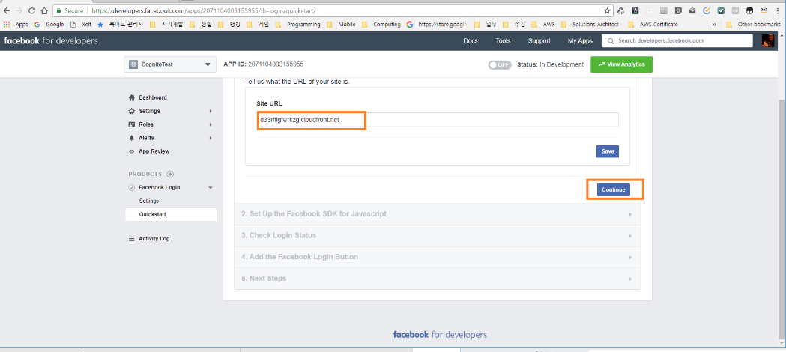

10. 다음의 정보를 입력하여 생성합니다. 이번에는 Python으로 작업해봅니다.

    | Name  | CatchScoreUpdate          
    |-------|---------------------------
    | **Runtime** | **Python 3.6**
    | **Role** | **gamescore-update-role** 
    | Timeout | 1 min                     

```python
from __future__ import print_function
import boto3
import json
import decimal
from boto3.dynamodb.conditions import Key, Attr
from botocore.exceptions import ClientError

dynamodb = boto3.resource("dynamodb")
table = dynamodb.Table('DemoScoreHistory')

def increment_score(score_key):
    response = table.update_item(
        Key={'score': score_key },
        UpdateExpression="set totalcount = totalcount + :val",
        ExpressionAttributeValues={':val': decimal.Decimal(1) },
        ReturnValues="UPDATED_NEW"
    )
    return response

def lambda_handler(event, context):
    for record in event['Records']:
        print(record)
        newScore = int(record['dynamodb']['NewImage']['score']['N'])
        try:
            table.put_item(
                Item={ 'score': newScore, 'totalcount': 1 },
                ConditionExpression=Attr("score").ne(newScore) 
                )
        except ClientError as e:
            if e.response['Error']['Code'] == "ConditionalCheckFailedException":
                print(e.response['Error']['Message'])
                increment_score(newScore)
            else:
                raise
        else:
            print("PutItem succeeded:")
    return 'Successfully processed {} records.'.format(len(event['Records']))

```

API Gateway
-----------

이제 생성한 lambda 함수들을 API Gateway에 추가합니다.

1.  AWS Management Console에서 **API Gateway** 서비스에 접속합니다.

2.  실습에는 scoreboard와 scorehistory 두 가지 리소스가 더 필요합니다. Lab.1
    에서 생성했던 API에서 Actions드롭다운메뉴에서 **Create Resource** 메뉴를
    선택합니다.

    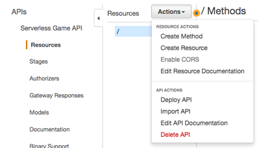

3.  Resource Name에 scoreboard를 입력하고 **Enable API Gateway CORS**를 체크한
    뒤 **Create Resource**를 진행합니다.

4.  동일한 방법으로 scorehistory도 생성합니다. 이 때 Resource Path에 주의합니다.
    다음과 같이 두 개의 리소스를 생성한 뒤 다음으로 진행합니다.

    

5.  Method 생성을 진행합니다. /scoreboard 리소스를 선택하고 Actions의 Create
    Method를 선택합니다.

6.  GET을 선택한 뒤 체크 버튼을 클릭합니다.

    

7.  **Lambda Region**은 Lambda를 생성한 리전을 선택하고 **Lambda Function**은
    앞서 생성한 GetUserScore를 입력합니다. **Save**를 클릭합니다.

    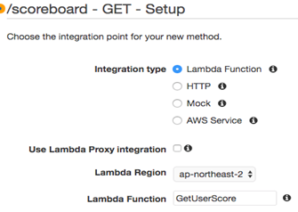

8.  위와 같은 방식으로 /scoreboard의 **POST**에는 PutUserScore 함수를
    /scorehistory의 **GET**에는 GetScoreHistory를 설정해줍니다.

    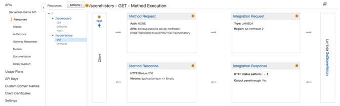

9.  scoreboard 리소스를 선택한 뒤 Actions의 Enable CORS 메뉴를 선택합니다.
    옵션은 변경하지 않고 **Enable CORS and replace existing CORS headers**
    버튼을 클릭하고 **Yes, replace existing values** 버튼을 차례로 클릭합니다.
    동일한 방법으로 scorehistory 리소스도 진행합니다.

    

10. 생성한 API를 배포해줍니다. 상위 경로 / 를 선택한 뒤 Actions의 Deploy API
    메뉴를 클릭합니다.
    
    

11. Deployment stage는 Lab1에서 사용하였던 prod를 선택한 뒤 Deploy 버튼을
    클릭합니다.

    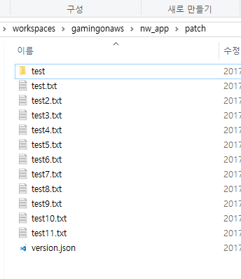

12. 생성된 Invoke URL은 뒤의 게임 client설정에 필요합니다.

13. 진행을 완료하면 Lambda에서 앞서 Trigger를 설정하지 않은 PutUserScore,
    GetUserScore, GetScoreHistory에 Trigger가 추가된 것을 확인할 수 있습니다.

    

애플리케이션 설정 및 테스트
---------------------------

이제 위 단계에서 설정한 API Gateway API들을 게임에서 사용하도록 설정하고 게임을
테스트해 볼 차례입니다.

1.  nw_app의 script폴더의 config.json파일에 scorehistory, scoreboard API의
    Endpoint URL을 설정합니다.(API resource path까지 포함하여 설정하여야 합니다. 혹은 Lambda 함수의 Trigger 항목에서 method를 클릭하면 나오는 Invoke URL을 사용하셔도 됩니다.)

    
```json
{
    "bucketname":"<s3 bucket name>", 
    "uploadprefix":"update", 
    "region":"ap-northeast-2", 
    "api_url":"<api_gateway prod endpoint url(+method name if specified>",
    "IdentityPoolId":"<cognito Identity Pool ID >", 
    "cloudfrontDistributionId":"<cloudfrontDistributionId(not domain name, randomized string id)>",
    "cloudfrontURL":"http://<cloudfrontdomaindanme>",    
    "scorehistory_api_url":"<invoke_URL>/scorehisto",
    "score_api_url":"<invoke_URL>/scoreboard"
}
```

1.  nw_app을 실행하고, Kakaotalk에 로그인한 후 launch버튼을 누르면 게임이
    시작됩니다.

2.  마우스 클릭이나 space바를 눌러 게임을 진행할 수 있습니다. 게임이 진행된 후
    score board가 출력되는지, View Score statistics 링크를 클릭하여 score
    history가 정상적으로 출력되는지 확인합니다.

    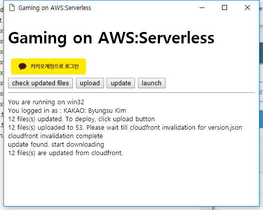
    
    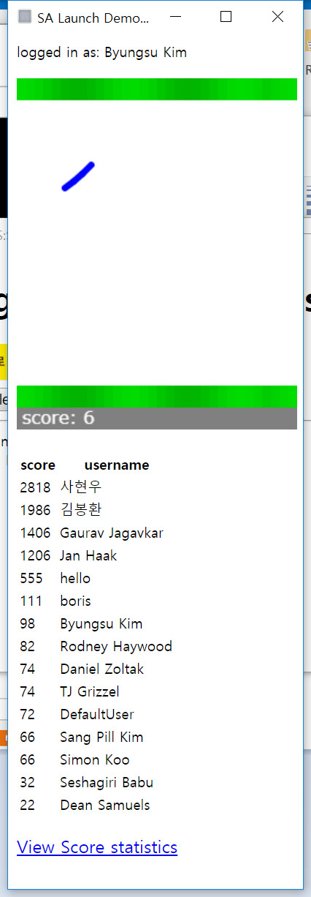

    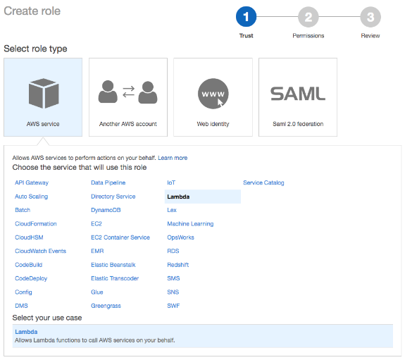

리소스 정리하기
===============

수고하셨습니다! 이제 서버리스로 게임 서비스 구현하기 Hands on Lab이 모두
완료되었습니다. 오늘 사용한 모든 서비스들은 Free Tier로 계정 생성후 1년간은
비용이 발생하지 않지만, 1년 후에는 작은 금액이나마 과금이 일어날 수 있으므로
리소스를 정리하여야 합니다. 예상하지 않은 비용이 발생하지 않도록오 늘 실습에서
사용한 다음 리소스들을 삭제하시기 바랍니다.

1.  S3 Bucket 삭제

2.  Cloudfront Distributions 삭제

3.  API Gateway API 삭제

4.  Lambda Function 삭제

5.  DyanmoDB Table 삭제 (Stream은 Table을 삭제하면 함께 삭제됩니다.)
